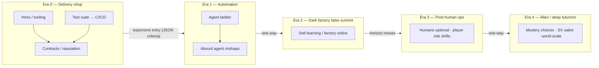

# P0.2 — Decision graph as curriculum map: Product plan

Date: 2026-08-11
Status: Direction settled; simplification next steps listed for issue cut
Milestone: [P0.2 — Decision graph as curriculum map](https://github.com/anne-markis/software-factory-the-game/milestone/2)
Extends: `docs/VISION.md` (updated same date), planning conversation 2026-08-11

This plan records the **settled product direction** for journeys / the
decision graph, and the **near-term simplification work** that should
become GitHub issues on P0.2 before we author longer eras. It is not yet
a full user-story / FR cut like P0.1; cut tickets from §4 when ready.

Existing honesty tickets (#39, #32, #47) remain in scope; they sit
alongside simplification rather than replacing it.

---

## 1. Settled direction (planning 2026-08-11)

### Long arc

- **One long game:** automation → dark factory → increasingly sci-fi /
  world-eating consequences (Paperclips-shaped cadence).
- **False summit:** reaching today’s “self-learning agents” (or equivalent)
  should feel like arrival, then the horizon keeps moving. No win screen;
  endless play with eras that take a long time to *earn*.
- **Tone:** early game stays a boring software delivery shop. Weirdness,
  SV satire, and deep futurism leak in **later**, not as day-one flavor.
- **Whimsy** on scenarios and late choices; **systems honesty** stays in
  stocks, flows, delays, and governors.

### Not tracks

- **No first-class tracks or tags** as a player-facing or curriculum
  concept. Formal solo / startup / megacorp / darkfactory “attractors”
  as peer endgames are retired.
- **Dark factory far-future is the spine.** Other paths (hiring humans,
  process discipline, funding-shaped growth, staying lean) are
  **meandering ways to gather resources and survive**, not alternate
  campaigns on the same horizon.
- **Startup / megacorp** (when/if content returns) = methods of gaining
  money and scale along the journey, stopovers that can feed the dark
  factory arc — not mutually exclusive routes and not peer endgames.
- True late automation should be **expensive**. How the player funds it
  is gameplay.

### Parked for a later pass

- Headcount (`human: true`) vs any leftover “human” labeling — revisit
  when touching hire/challenge content, not in the first simplification
  cut.
- Full era content authorship (post–self-learning sci-fi ladder) — after
  the graph is simpler and content-driven.

---

## 2. Architectural goals

1. **Journey graph lives in JSON.** Requires / unlocks / costs / effects /
   challenge gates / project gates / **era entry** should express
   progression. Prefer content fields + generic engine predicates over
   TypeScript that knows story beats or track names.
2. **Simplify before lengthening.** Remove first-class track/tag machinery
   and docs drift *before* splitting into multi-era content, so longer
   journeys do not grow on a dual human/tag/track vocabulary.
3. **Eras are first-class in content, not in story code.** Each era is its
   own JSON (bundle or folder — see §2.1). The engine may hold
   `state.eraId` (or equivalent) read from content and advance it when
   content-defined entry criteria fire. It must not hardcode era names,
   flavor, or per-era special cases in the tick.
4. **Era transitions are one-way.** Many steps may lead *into* an era;
   once entered, the player cannot return to a prior era’s shop/pool.
   Prior owned effects may still apply (or be retired by content rules) —
   the irreversible part is **which era’s decision/challenge graph is
   live**, not necessarily wiping history.
5. **Authoring visibility:** a light local graph viewer reads the same
   JSON and shows decisions → requires/criteria → era edges. Framework-
   only; stand up with `make graph` (or similar). Not part of the player
   game UI.
6. **Existing content is not sacred.** Cards, tags, and thin branches may
   be deleted or rewritten when they fight the spine.

### 2.1 ADR — Per-era JSON layout (proposed)

**Decision:** one content bundle per era; a small index lists order and
entry criteria.

Proposed shape (names flexible at implementation):

```text
content/
  start.json                 # global constants, seed stocks (era-agnostic)
  eras.json                  # ordered era ids + entry criteria refs
  eras/
    delivery/
      meta.json              # id, name, player-facing blurb (optional)
      decisions.json
      challenges.json
      projects.json          # optional; may stay global longer
    automation/
      ...
    dark-factory/
      ...
```

**Entry criteria** live in `eras.json` (or each era’s `meta.json`), e.g.
owned decision ids, budget floor, reputation floor, stock thresholds —
same predicate vocabulary as challenges where possible. Crossing criteria
sets `eraId` forward only.

**Load merge rule (engine):** active content = `start` + **current era’s**
decisions/challenges/projects (plus any explicitly marked “carry”
globals if we need them). Prior-era decision *definitions* need not stay
in the shop; owned instances already on the save remain until removed by
normal rules unless content says otherwise.

**Rejected for now:** single monolithic `decisions.json` with an `era`
field on every card (harder to visualize/author per act); TypeScript
era enums; player-facing “pick your era” modes.

### 2.2 ADR — Graph viewer (proposed)

**Decision:** separate tiny static tool under something like
`tools/content-graph/`, not wired into the game shell.

- Reads era JSON via the same Zod parse path (or a thin shared loader).
- Renders nodes (decisions) and edges (`requires`, synergy `ifOwned`,
  era-entry edges).
- Shows criteria text on nodes/edges (cost, requires, era entry).
- Local only: `make graph` → serve on a localhost port (Vite or
  static). No deploy requirement for v1.
- Framework-light: plain HTML/CSS/JS or minimal Vite page; graph layout
  can start as layered DAG (era columns × require tiers), not a heavy
  editor.

Candidate issue **V-1** below.

---

## 3. Milestone intent (P0.2)

Make the **decision graph honest and content-owned**, strip track/tag
first-class concepts, and leave a clean surface for later era content —
without yet shipping the full sci-fi ladder.

**In one sentence:** by the end of P0.2, progression is “what you bought
and can afford,” expressed in JSON, with no track taxonomy — and the
graph does not lie about synergies, gambles, or the release unlock path.

---

## 4. Next steps → candidate P0.2 issues

Cut these as GitHub issues when ready (titles are suggestions). Order is
**simplify first**, then honesty polish already filed, then light prep
for eras (docs/content shape only — not full sci-fi content).

### Must — simplify the journey surface

| ID | Candidate issue | Why |
| --- | --- | --- |
| **S-1** | Remove decision `tags` and challenge `hasTag` as first-class curriculum/track API | Settled: no tags/tracks. Today only `darkfactory` / `human` gates use `hasTag`; replace those gates with content predicates that do not invent a track layer (e.g. `requiresAnyDecision`, `minOwnedMatching`, or explicit decision-id / category gates — pick the smallest generic JSON shape). |
| **S-2** | Retire track vocabulary from docs and authoring guide | VISION updated; still need `CONTENT-AUTHORING.md`, design doc § tracks, triage prompt P1.1 mapping, and any “solo/startup/megacorp” authoring language aligned or marked historical. |
| **S-3** | Audit engine/UI for track/tag leakage and delete dead path | Orphan tag readers, UI “You are a solo dev” if it implies a track, tests that pin `hasTag: "darkfactory"` as a track concept, unused `process`/`solo` tag data once S-1 lands. Goal: smaller surface, journey edges only in content. |
| **S-4** | Replace darkfactory/human challenge gates with JSON-owned predicates | Companion to S-1: ship equivalent (or intentionally simpler) challenge eligibility without tags so automation-heavy and hire-heavy pools still differ because of **owned decisions / headcount / stocks**, not track labels. |

### Should — graph honesty (already filed)

| Issue | Role under new direction |
| --- | --- |
| **#39** | Unlock telegraph: Done bottleneck → test-suite / CI/CD path. Curriculum signpost without tracks. |
| **#32** | Agent harness synergy honesty. Trust on the automation ladder. |
| **#47** | Hire gamble downside telegraph. Early shop stays “boring but honest.” |

### Could — era packaging + authoring tools (after simplify)

| ID | Candidate issue | Why |
| --- | --- | --- |
| **E-1** | Split content into per-era JSON + `eras.json` index with one-way entry criteria | Implements §2.1. First cut can put *all current* cards in `delivery` (or `delivery` + `automation`) with a single forward gate stub so the loader/viewer are real before sci-fi content exists. |
| **E-2** | Inventory which current decisions are spine vs funding-detour vs cut candidates | Prep for meandering resource journeys; may delete thin solo-as-track cards or rehome them as plain early tools. |
| **V-1** | Local content-graph viewer (`make graph`) | Implements §2.2. Reads era JSON; shows requires / costs / era-entry edges. Authoring aid only. |

### Explicitly out of scope for P0.2 issue cut

- Full post–self-learning sci-fi decision/challenge wave
- Startup/megacorp funding content as a real stopover (design OK; ship later)
- Player-optional / “factory without you” structure changes (long-term)
- Headcount flag redesign (parked)
- Reopening P0.1 cockpit work
- Shipping the graph viewer inside the player-facing game UI

---

## 5. Eras brainstorm (decision ladder)

Working sketch. Early = boring shop; weirdness later. **Within** an era,
many purchases meander; **between** eras, entry is gated and irreversible.



| Era | Player-facing feel | Rough content role |
| --- | --- | --- |
| **0 — Delivery shop** | Hire, ship, debt, CI/CD, contracts. Realistic SDLC toy. | Current core loop; keep legible. Meander for money. |
| **1 — Automation** | Agents, harness, swarm; compute/debt bite; absurd mishaps begin. | Current agent ladder; honesty fixes (#32). Entry should feel costly. |
| **2 — False summit** | “Dark factory” online — feels like endgame. | Today’s self-learning (or successor); then reveal the horizon moves. |
| **3 — Post-human ops** | Humans optional/liability; player role starts to shift. | New JSON decisions + governors; expensive. |
| **4 — Alien / deep futurism** | Paperclips-energy mystery choices; SV satire; world-scale absurdity. | Long-horizon content; whimsy OK if loops stay honest. |

Funding detours (growth rounds, “megacorp” carve-outs, grind contracts)
live **inside** early eras as ways to afford the next era’s entry gate,
not as parallel endgames. Once the gate fires, the prior era’s shop
rotates out (one-way).

---

## 6. Working definition of done (draft)

P0.2 is **done enough to close** when:

1. **No first-class tags/tracks** in schema, runtime challenge gating, or
   player-facing copy that teaches “you are on track X.”
2. **Challenge pools** that used `hasTag` still make sense via JSON-owned
   predicates (or are intentionally simplified with a milestone comment).
3. **Docs/authoring** no longer instruct authors to use track tags as the
   curriculum map (VISION + this plan + authoring guide agree).
4. **Honesty tickets** #39, #32, #47 closed or explicitly deferred with
   reason on the milestone.
5. **Era packaging path is clear:** either E-1 landed (per-era JSON +
   one-way entry stub) or explicitly deferred with the ADR accepted and
   a follow-up milestone noted — but authors must know the target layout.
6. **Graph viewer:** V-1 landed or deferred with `make graph` stub noted;
   preferred inside P0.2 so era splits are reviewable.
7. Tests + `npm run build` green; engine/UI boundary intact.

Full sci-fi ladder and funding-stopover content are **successors**, not
blockers for closing P0.2.

---

## 7. Relationship to other docs

| Doc | Role |
| --- | --- |
| `docs/VISION.md` | Living direction; medium-term attractor language updated to match this plan |
| `docs/superpowers/specs/2026-08-07-p01-cockpit-watchability-plan.md` | P0.1; Done cue without CI/CD name — #39 is the P0.2 handoff |
| `docs/CONTENT-AUTHORING.md` | Must be updated when S-1/S-2 land |
| `docs/OPEN-DECISIONS.md` | Unrelated open tactics; do not stuff journey eras here |
| `scripts/issue-triage-prompt.md` | Update P0.2 / P1.1 mapping when track vocabulary is retired |

When implementation specs conflict with this plan, update one deliberately
before coding.
