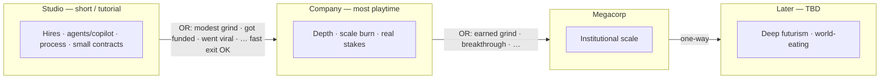
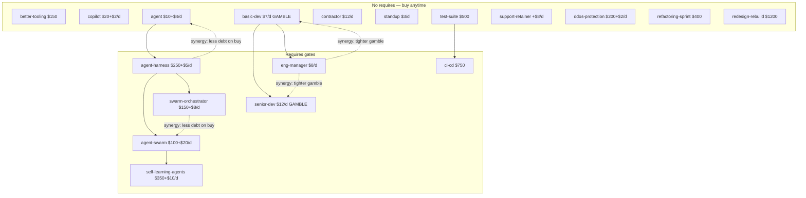
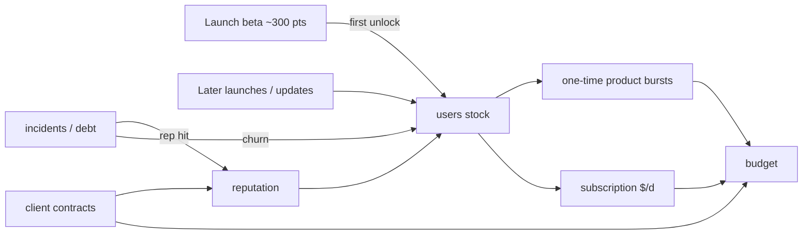
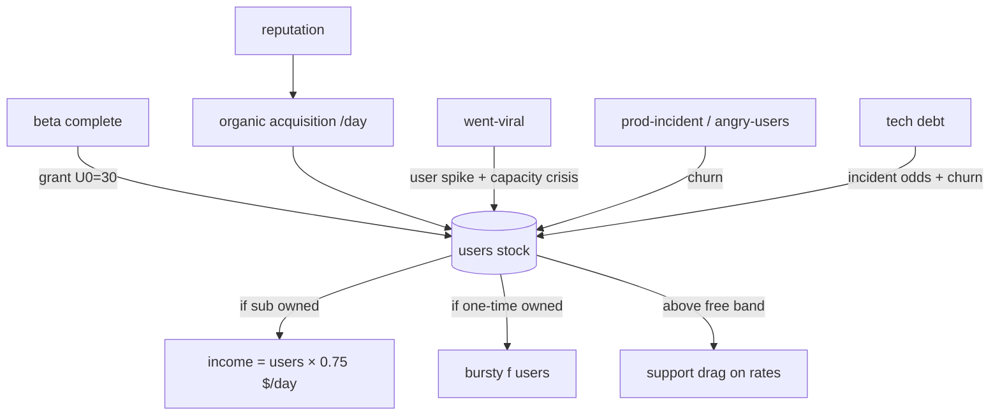
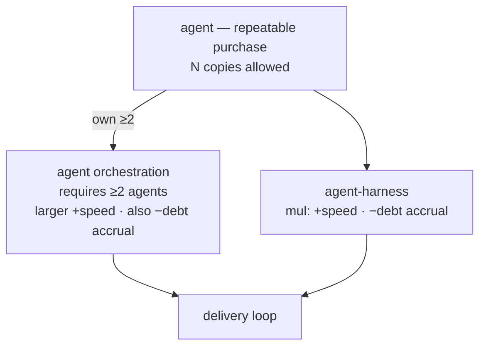
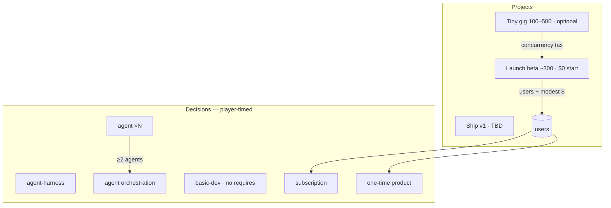

# P0.2 — Decision graph as curriculum map: Product plan

Date: 2026-08-11
Status: Direction settled; simplification next steps listed for issue cut
Milestone: [P0.2 — Decision graph as curriculum map](https://github.com/anne-markis/software-factory-the-game/milestone/2)
Extends: `docs/VISION.md` (updated same date), planning conversation 2026-08-11

This plan records the **settled product direction** for journeys / the
decision graph, and the **near-term simplification work** that should
become GitHub issues on P0.2 before we author longer eras. It is not yet
a full user-story / FR cut like P0.1; cut tickets from §4 when ready.

Existing honesty tickets (#39, #32, #47) remain in scope; they sit
alongside simplification rather than replacing it.

---

## 1. Settled direction (planning 2026-08-11)

### Long arc

- **One long game** with Paperclips cadence: long grinds between
  *scale* thresholds, then newly strange choices open. No win screen.
- **Eras = progression of scale (cost of play), not capability tracks.**
  Demarcate by what a factory can afford and what problems that scale
  invites — not by “pre-agent SDLC” vs “automation.” Starting from zero
  today, agents/coding assistants belong in the first era alongside
  hires, git, and (often later) CI/CD.
- **Tone:** early game is a short **Studio** stretch (tutorial-scale;
  starting ~$10k; player can leave relatively fast). Most of the long
  session lives in **Company**. Weirdness, SV satire, and deep futurism
  intensify from **Megacorp** onward — not as day-one flavor, and not
  gated behind “unlocking AI.”
- **False summits** still exist at later scale rungs but sit on the
  **scale ladder**, not on a parallel automation track. Horizon keeps
  moving after each summit.
- **Whimsy** on scenarios and late choices; **systems honesty** stays in
  stocks, flows, delays, and governors.

### Eras vs old “tracks”

- **No first-class tracks or tags** as peer endgames (solo / startup /
  megacorp / darkfactory as mutually exclusive campaigns are retired).
- **Eras replace that vocabulary as a one-way progression ladder** —
  settled working names: **Studio → Company → Megacorp → …** (capability
  mix meanders inside each rung). Words like megacorp mean **how big you
  are**, not which parallel fantasy you picked.
- **Within an era:** meander (hire-heavy, agent-heavy, process-heavy,
  viral/funding luck). **Between eras:** irreversible entry once scale
  criteria (or lucky breakthrough rolls) fire.
- Late / expensive world-eating content is gated by **being able to pay
  for it at that scale**. How you got the money is gameplay.

### Parked for a later pass

- Headcount (`human: true`) vs any leftover “human” labeling — revisit
  when touching hire/challenge content, not in the first simplification
  cut.
- Exact dollar thresholds and breakthrough-roll design (“got funded”,
  “went viral”, …) for Studio→Company and Company→Megacorp — brainstorm
  in §5; ship after simplify + packaging.
- Names for rungs after Megacorp.
- Full late-era sci-fi content authorship — after the graph is simpler
  and content-driven.

---

## 2. Architectural goals

1. **Journey graph lives in JSON.** Requires / unlocks / costs / effects /
   challenge gates / project gates / **era entry** should express
   progression. Prefer content fields + generic engine predicates over
   TypeScript that knows story beats or track names.
2. **Simplify before lengthening.** Remove first-class track/tag machinery
   and docs drift *before* splitting into multi-era content, so longer
   journeys do not grow on a dual human/tag/track vocabulary.
3. **Eras are first-class in content, not in story code.** Each era is its
   own JSON (bundle or folder — see §2.1). The engine may hold
   `state.eraId` (or equivalent) read from content and advance it when
   content-defined entry criteria fire. It must not hardcode era names,
   flavor, or per-era special cases in the tick.
4. **Era transitions are one-way.** Many steps may lead *into* an era;
   once entered, the player cannot return to a prior era’s shop/pool.
   Prior owned effects may still apply (or be retired by content rules) —
   the irreversible part is **which era’s decision/challenge graph is
   live**, not necessarily wiping history.
5. **Authoring visibility:** a light local graph viewer reads the same
   JSON and shows decisions → requires/criteria → era edges. Framework-
   only; stand up with `make graph` (or similar). Not part of the player
   game UI.
6. **Existing content is not sacred.** Cards, tags, and thin branches may
   be deleted or rewritten when they fight the spine.

### 2.1 ADR — Per-era JSON layout (proposed)

**Decision:** one content bundle per era; a small index lists order and
entry criteria.

Proposed shape (names flexible at implementation):

```text
content/
  start.json                 # global constants, seed stocks (era-agnostic)
  eras.json                  # ordered era ids + entry criteria (OR-able paths)
  eras/
    studio/                  # short tutorial-scale era; ~$10k start fits
      meta.json              # id, name, player-facing blurb (optional)
      decisions.json         # hires AND agents/copilot AND process, etc.
      challenges.json
      projects.json
    company/                 # main long-session era
      ...
    megacorp/
      ...
    # later eras TBD (sci-fi / world-eating at cost)
```

**Do not** split eras by capability (e.g. “delivery” vs “automation”).
Agents belong in Studio content when costs fit that scale.

**Entry criteria** live in `eras.json` (or each era’s `meta.json`).
Prefer **OR of paths**, e.g. out of Studio into Company — any of:

- slow grind: budget / reputation / contract floors (exact numbers TBD;
  Studio should be *exitable fast*, so grind bar is modest or skippable
  via breakthrough);
- breakthrough rolls / challenges: “got funded”, “went viral”, etc.
  (exact events TBD — content, not engine special cases).

Company → Megacorp (and later) use the same OR pattern at higher bars —
Company is where most playtime lives, so its exit should feel earned.

Crossing any listed path sets `eraId` forward only.

**Load merge rule (engine):** active content = `start` + **current era’s**
decisions/challenges/projects (plus any explicitly marked “carry”
globals if we need them). Prior-era decision *definitions* need not stay
in the shop; owned instances already on the save remain until removed by
normal rules unless content says otherwise.

**Rejected for now:** single monolithic `decisions.json` with an `era`
field on every card (harder to visualize/author per act); TypeScript
era enums; player-facing “pick your era” modes.

### 2.2 ADR — Graph viewer (proposed)

**Decision:** separate tiny static tool under something like
`tools/content-graph/`, not wired into the game shell.

- Reads era JSON via the same Zod parse path (or a thin shared loader).
- Renders nodes (decisions) and edges (`requires`, synergy `ifOwned`,
  era-entry edges).
- Shows criteria text on nodes/edges (cost, requires, era entry).
- Local only: `make graph` → serve on a localhost port (Vite or
  static). No deploy requirement for v1.
- Framework-light: plain HTML/CSS/JS or minimal Vite page; graph layout
  can start as layered DAG (era columns × require tiers), not a heavy
  editor.

Candidate issue **V-1** below.

---

## 3. Milestone intent (P0.2)

Make the **decision graph honest and content-owned**, strip track/tag
first-class concepts, and leave a clean surface for later era content —
without yet shipping the full sci-fi ladder.

**In one sentence:** by the end of P0.2, progression is “what you bought
and can afford *at this scale*,” expressed in JSON eras — with no track
taxonomy — and the graph does not lie about synergies, gambles, or the
release unlock path.

---

## 4. Next steps → candidate P0.2 issues

Cut these as GitHub issues when ready (titles are suggestions). Order is
**simplify first**, then honesty polish already filed, then light prep
for eras (docs/content shape only — not full sci-fi content).

### Must — simplify the journey surface

| ID | Candidate issue | Why |
| --- | --- | --- |
| **S-1** | Remove decision `tags` and challenge `hasTag` as first-class curriculum/track API | Settled: no tags/tracks. Today only `darkfactory` / `human` gates use `hasTag`; replace those gates with content predicates that do not invent a track layer (e.g. `requiresAnyDecision`, `minOwnedMatching`, or explicit decision-id / category gates — pick the smallest generic JSON shape). |
| **S-2** | Retire track vocabulary from docs and authoring guide | Landed in issue #92: `CONTENT-AUTHORING.md` + `CONTEXT.md` + ADRs 0001–0006; historical banners on v1/track design docs; triage P0.2 / P1.1 mapping uses eras not peer tracks. |
| **S-3** | Audit engine/UI for track/tag leakage and delete dead path | Orphan tag readers, UI “You are a solo dev” if it implies a track, tests that pin `hasTag: "darkfactory"` as a track concept, unused `process`/`solo` tag data once S-1 lands. Goal: smaller surface, journey edges only in content. |
| **S-4** | Replace darkfactory/human challenge gates with JSON-owned predicates | Companion to S-1: ship equivalent (or intentionally simpler) challenge eligibility without tags so automation-heavy and hire-heavy pools still differ because of **owned decisions / headcount / stocks**, not track labels. |

### Should — graph honesty (already filed)

| Issue | Role under new direction |
| --- | --- |
| **#39** | Unlock telegraph: Done bottleneck → test-suite / CI/CD path. Curriculum signpost without tracks. |
| **#32** | Agent harness synergy honesty. Trust on the automation ladder. |
| **#47** | Hire gamble downside telegraph. Early shop stays “boring but honest.” |

### Could — era packaging + authoring tools (after simplify)

| ID | Candidate issue | Why |
| --- | --- | --- |
| **E-1** | Split content into per-era JSON + `eras.json` with one-way **scale** entry criteria | Implements §2.1. First cut: put *all current* cards in `studio`; stub `company` + entry (modest grind and/or breakthrough placeholder) so loader/viewer are real. **Not** a delivery/automation split. Studio must stay short/exitable. |
| **E-2** | Inventory which current decisions fit Studio costs vs belong in Company+ | Retune or move cards whose prices break the ~$10k Studio fantasy; agents/copilot stay eligible in Studio if costs fit. Most depth lands in Company. |
| **V-1** | Local content-graph viewer (`make graph`) | Implements §2.2. Reads era JSON; shows requires / costs / era-entry edges (including OR entry paths). Authoring aid only. |

### Explicitly out of scope for P0.2 issue cut

- Full late-scale / sci-fi decision/challenge wave
- Final names and $ thresholds for eras after the first gate (brainstorm OK)
- Player-optional / “factory without you” structure changes (long-term)
- Headcount flag redesign (parked)
- Reopening P0.1 cockpit work
- Shipping the graph viewer inside the player-facing game UI
- Capability-based era splits (delivery vs automation) — rejected

---

## 5. Eras brainstorm (scale ladder)

**Settled ladder (simple):**

**Studio → Company → Megacorp → …**

| Era | Role in the long session |
| --- | --- |
| **Studio** | Tutorial-scale. ~$10k start fits. Player can leave **fast**. Teaches the delivery loop; hires *and* early agents/copilot OK. |
| **Company** | **Where most time is spent.** Depth, meander, governors, contract climb, breakthrough-or-grind toward Megacorp. |
| **Megacorp** | Institutional scale; satire / heavier systems; gate into later weirdness. |
| **…** | Later rungs TBD (false summit, sci-fi, world-eating at cost). |

**Principle:** eras mark **how big the business is**. They do **not** mark
“you unlocked AI.” Capability mix meanders *inside* each era. Old
“tracks” were parallel plays; these are progression levels.



### Entry paths (open detail, schema shape settled)

- **Studio → Company:** keep the bar low or luck-skippable so Studio
  stays a tutorial, not a second main game. Working ideas: modest budget/
  reputation floor **or** “got funded” / “went viral” / similar.
- **Company → Megacorp:** higher bar; most session length happens before
  this gate. Exact $ / reputation / events TBD (earlier ~$5M sketch may
  fit *here* better than out of Studio).
- Schema: **multiple OR entry predicates** per era so grind and luck both
  work without engine forks.

### Naming

Studio / Company / Megacorp are **settled** for the first three rungs.
Later names stay open. Prefer size language; keep “got funded” /
“went viral” as **events**, not rung labels.

---

## 5.1 Studio zoom (inventory of *today’s* content)

Eras are not split in JSON yet. This section sorts **shipped** decisions,
gates, challenges, and projects into a **provisional Studio cut** vs
“push to Company+,” for brainstorming only — not sacred, not tickets.

Baseline: start budget **$10k**, base burn **$20/day**, first contract
1500 pts @ $17/pt + $2k bonus.

### Decision graph (requires + synergies)



### Provisional Studio vs Company+ (cost / tutorial lens)

| id | Cost | Gates | Studio lean |
| --- | --- | --- | --- |
| **better-tooling** | $150 once | — | **In** — cheap, teaches rate bump |
| **copilot** | $20+$2/d | — | **In** — modern “assistant before CI” |
| **agent** | $10+$4/d | — | **In** — early agent; debt catch |
| **basic-dev** | $7/d gamble | — | **In** — core hire lesson |
| **contractor** | $12/d | — | **Maybe** — safe hire; overlaps senior burn |
| **standup** | $3/d | — | **In** if any hire/agent team exists |
| **test-suite** | $500 | — | **In** — debt + unlocks CI |
| **ci-cd** | $750 | requires test-suite | **In** — main structural teach (#39) |
| **support-retainer** | +$8/d, −5% rates | — | **In** — income vs slowdown |
| **ddos-protection** | $200+$2/d | — | **In** — pairs with ddos challenge |
| **refactoring-sprint** | $400 | — | **Maybe** — debt recovery; OK if debt appears in Studio |
| **agent-harness** | $250+$5/d | requires agent | **Maybe / light** — second step on agent path; honesty bug #32 |
| **eng-manager** | $8/d | requires basic-dev | **Push?** — management layer feels Company |
| **senior-dev** | $12/d | requires basic-dev | **Push?** — or keep one senior as Studio stretch |
| **redesign-rebuild** | $1200 + long slowdown | — | **Push** — heavy for tutorial |
| **agent-swarm** | $100+$20/d | harness | **Push** — burn alone rivals Studio runway |
| **swarm-orchestrator** | $150+$8/d | harness | **Push** with swarm |
| **self-learning-agents** | $350+$10/d | swarm | **Push** — false-summit / Company+ |

Soft teaching gates (not `requires`, but the loop teaches them): hire
without CI → Done piles up; agent without harness → debt; zero humans →
laptop-dies.

### Challenges — what fires in a Studio-shaped run

| Challenge | Gate today | Studio lean |
| --- | --- | --- |
| scope-creep | minDay 15 | **In** |
| prod-incident | minDay 15, debt scales | **In** (light) |
| ddos | minDay 15, lacks ddos-protection | **In** |
| open-source-windfall | minDay 15 | **In** (lucky money) |
| sickness | minHumanDevs ≥ 1 | **In** if hires |
| key-dev-poached | minHumanDevs ≥ 1 | **Maybe** — choice teach; $150 match |
| laptop-dies | maxHumanDevs 0 | **In** for solo/agent-only |
| meeting-creep | hasTag human | **Push?** — Company calendar pain |
| team-conflict | hasTag human | **Maybe** |
| model-deprecation / api-price-hike / runaway-agent-loop / cloud-credits | hasTag darkfactory | **In-light** if Studio keeps agent; or delay until harness/Company |
| security-breach | techDebt ≥ 800 | **Push** — needs real debt pile |

### Projects / reputation (today)

| Project | Gate | Studio lean |
| --- | --- | --- |
| first-contract (start) | — | **In** — the tutorial ship |
| small-crm | afford $2k upfront | **In** or early Company |
| mobile-app / big-migration | 1 completion + rep 5 | **Company** (Trusted vendor) |
| enterprise-replatform | 2 completions + rep 15 | **Company+ / Megacorp-adjacent** |

Reputation milestones “Trusted” (5) / “Established” (15) currently sit
on the same endless ladder — likely **Company** landmarks, not Studio
exits.

### Studio → Company exit (still open)

Not implemented. Working intent: **fast exit**, OR of modest grind and
breakthroughs (funded / viral / …). Do **not** require finishing the
agent swarm ladder or enterprise contracts to leave Studio.

### Open questions for this zoom

1. How small is Studio’s shop — **core 8–10 cards** or most of today’s
   catalog with only swarm/rebuild deferred?
2. Is **CI/CD** a Studio must-teach, or can some players exit Studio
   still Done-bound and learn it in Company?
3. Should **agent-harness** be the Studio agent ceiling (one upgrade
   deep), with swarm+ reserved for Company?
4. Breakthrough exits: which events are Studio-valid without breaking
   the “short tutorial” feel?

---

## 5.2 Studio from scratch (solo-dev-today)

**Status:** redesign brainstorm. Shipped Studio-shaped content above is
**reference only** — not a keep-list. Start from “I am a solo developer
starting today” and rebuild plays + money.

### Critiques of the shipped tree (accepted as design pressure)

1. **Copilot vs agent** — mechanically both are “pay upkeep → multiply
   finish, add debt.” Copilot: ×1.15 finish, ×1.05 debt, $2/d, unique.
   Agent: ×1.20 finish, ×1.20 debt, $4/d, opens harness ladder. The
   lived difference is thin; the ladder is the only real distinction.
   Not good enough for Studio.
2. **Money options** — `support-retainer` (+$8/d, −5% rates) is a weak
   / implausible primary for a solo. Missing subscription product,
   donations/sponsors, ads, marketplace, etc.
3. **Standup costs money** — $3/d for a ritual that is mostly time, not
   cash. Smells wrong for Studio (and often for Company).
4. **Hiring out of the box** — another full-time dev at $7–12/d on a
   $10k / $20 base-burn runway is a late Studio or Company move, not an
   immediate play. First shop should not center on headcount.

### First-principles prompt (keep asking)

If I were a solo starting today:

- What do I buy/set up in week 1?
- How do I expect to make money before I can hire?
- What breaks (laptop, burnout, scope, deps, cloud bill)?
- When does “second human” or “serious agent fleet” become rational?

### Draft Studio plays (sketch — not cards yet)

**Immediate (day-zero / first weeks)**

| Play | Why it’s real | Systems hook (possible) |
| --- | --- | --- |
| Ship the first thing | You’re already on a contract / building an MVP | Existing delivery loop + first-contract |
| Editor / tooling | Real first spend | Small permanent rate bump |
| Coding assistant (one clear AI seat) | Almost everyone tries one early | **One** AI-assist decision — merge/replace copilot+agent ambiguity |
| Git / basic hosting | Table stakes | Maybe free/flavor, or tiny cost + unlocks deploy path |
| Domain / landing page | Needed to sell anything | Tiny cost; unlocks some income paths |
| Time / focus (not standup-as-$/d) | Solo cost is attention | Maybe temporary rate tradeoffs, not payroll |

**Early money (before hire)**

| Play | Why it’s real | Systems hook (possible) |
| --- | --- | --- |
| Client contract (project) | Still primary for many solos | Keep projects; size them to Studio |
| Productized service / retainer | Possible later; not default day one | Optional, gated |
| Subscription / SaaS drip | Modern solo path | New income stock/effect: $/d with ops load |
| Donations / sponsors / “buy me a coffee” | Indie reality | Low $/d, reputation or viral coupling |
| Ads / affiliate | Common, often unfun | $/d with reputation or attention tax |
| Marketplace / template sales | One-shot or slow drip | Burst budget or small income |
| Went viral / launched on HN | Breakthrough | Studio→Company exit OR cash+rep spike |

**Later Studio (still alone or almost)**

| Play | Why it waits | Systems hook (possible) |
| --- | --- | --- |
| Tests → CI | After you’ve felt Done/ship pain | Keep as structural teach |
| DDoS / basic hardening | After you’re public | Keep light |
| Refactor when debt hurts | Reactive | Keep |
| Contractor / part-time help | Cheaper than FTE | Maybe before full hire |
| First hire | Expensive; needs runway + demand | Gate on budget/income/reputation — not open day one |
| Heavier agent / harness | After assistant proves itself | Distinct from “one AI seat”; cost + debt governors |

**Explicitly not Studio-default**

- Eng manager, senior ladder, agent swarm, self-learning, redesign-rebuild
- Standup-as-daily-cash-burn
- Parallel near-duplicate AI cards

### Open design questions (Studio only)

1. ~~**Single AI seat vs ladder**~~ → **Settled:** Studio AI = **agent**
   (repeatable — buy many). Drop **copilot**. **Harness** + **agent
   orchestration** (rename of swarm) are **in Studio**; player times them
   against budget like hiring. Orchestration needs **≥2 agents**; it
   speeds delivery and **slows debt accrual**. Heavier toys
   (self-learning, etc.) still later.
2. ~~**Income model**~~ → **Settled (A) spine:** Studio money =
   **contracts** + **subscription** + **one-time product purchases**.
   **Users stock:** 0 until beta launch; product cards read users.
3. ~~**Hire gate**~~ → **Settled:** hire **always visible**, **no
   `requires`**. Player judges budget.
4. ~~**Standup / burnout**~~ → **Deferred to Company.** Not a Studio
   concern.
5. **Users / monetization mockup:** formula, card timing, harness vs
   orchestration effect split, agent stacking math.

### 5.2.1 Studio product money + users (exploring)

**Money spine (settled):** contracts + subscription + one-time product
(marketplace fiction OK).

**Users stock (reopened — interesting):** instead of faking growth with
a blind time-ramp, track **users** as a real stock. Subscription and
one-time product value then *read* users (and maybe reputation) rather
than inventing customers offstage.

#### Why it’s compelling (systems-wise)

- New reinforcing loop: ship product → users → income → more build
  capacity → better product / reputation → more users.
- Reputation stops being “only for bigger contracts” — it can also be
  **trust that acquires or retains users**.
- Governors write themselves: outages, bad launches, debt-driven
  incidents, pricing anger → user churn; support load → rate drag.
- Studio→Company can re-interpret the same stock at a new scale without
  a parallel “fake ramp” mechanic.

#### Sketch (not locked)

| Piece | Role |
| --- | --- |
| **Stock: `users`** | Non-negative; **stays 0 until first launch** (settled). |
| **Inflows** | Completing launch / beta project; later marketing; reputation-gated organic growth; viral challenge; product updates (?) |
| **Outflows** | Churn from incidents, neglect, bad support; competitor events |
| **Subscription income** | ≈ `f(users)` per day (content formula: linear, diminishing, tier steps) |
| **One-time product** | Bursts scaled by users (or by *new* users this window) — lumpier than sub |
| **Contracts** | Client work — orthogonal money; may not unlock users by itself |
| **Reputation** | Affects acquisition rate and/or churn; damaged by breaches/incidents |



#### Settled forks

1. **When do users appear?** **Settled — option 1:** users stay **0
   until launch**. First meaningful ship is reframed as **“Launch beta
   release”** (working size **~300 points**, down from today’s 1500
   “First Contract”), and completing it **starts user acquisition**.
   Client contracts are a separate money path and do not by themselves
   invent users.
2. **Projects are era-scoped** — revisit the whole project list per era
   (§5.3). Today’s CRM / migration / enterprise ladder is not sacred.

#### Still open

3. **One product or many?** Single generic “your product” for Studio
   vs separate subscription SKU and one-time SKU sharing one user base.
4. **Formula complexity:** `incomePerDay = users * k` and
   `acquisition = g(reputation)` enough for Studio?
5. **Era boundary:** users carry into Company vs soft reset / segment
   change.
6. **Beta details:** starting backlog = 300? payout vs “you’re launching
   your own product” (maybe low/no client payout, reward = users + rep)?
   Relationship between beta launch and enabling subscription /
   one-time product decisions.

**Previous “compound until era, no users” assumption** remains a
fallback only. Prefer users-after-launch.

### 5.2.1a Users / monetization — working model (Studio)

**Status:** planning pass. Minimal formulas so the loop is watchable;
numbers are **working guesses** for solvency with ~$10k start + ~300-pt
beta — retune in mockup.

#### Settled shape (this pass)

| Piece | Working rule |
| --- | --- |
| **Stock** | **`users` is a real stock** (≥ 0). **0 until Launch beta completes**. There is **no separate subscriber stock** — subscription/one-time are decisions that *read* `users`, not a second population. |
| **One audience** | Single shared `users` base. Subscription and one-time product are **two monetization decisions** on that stock. |
| **Beta complete (Model B)** | Modest **cash bonus** + **initial user grant** + organic acquisition turns on. No upfront cost to start beta. |
| **Monetization cards** | Separate buys; do nothing useful while `users == 0`. No auto-unlock from beta (timing still mockup). |
| **Client gigs** | Cash + rep; **no direct users**. |
| **Income while cards unowned** | Launch bonus + gigs + windfalls only — still enough to finish beta without gigs (solvency rule). |
| **Support drag** | **In Studio v0** — users above a free band apply light delivery-rate drag (tickets/load). Rhymes with viral capacity crisis. |
| **Era boundary** | **`users` carries into Company** (problems scale; no soft reset). |
| **Trial numbers (first mockup)** | See table below — locked as starting point, retune in play. |

#### Trial numbers (locked for first mockup)

| Knob | Value |
| --- | --- |
| `U0` (users on beta complete) | **30** |
| `B_launch` (Model B cash bonus) | **$800** |
| Organic `baseAcquire` | **1.5 users/day** |
| `repBonus` | **reputation × 0.1** users/day |
| Baseline `churnRate` | **1%/day** |
| `k_sub` | **$0.75 / user / day** |
| One-time expected EV | **below** sub for same users (bursty; exact p/`k_ot` in mockup) |
| Support free band | **first ~25 users** no drag |
| Support drag | light finish (or all-rate) mul as users exceed band — exact curve in mockup |

At 30 users + sub owned ≈ **$22.5/day** before burn/upkeep — meaningful vs $20 base burn, not automatic win.

#### Loop (tick sketch)



#### Formulas (Studio v0)

**On Launch beta complete**

- `users += 30`
- `budget += 800`
- optional `reputation += 1`
- acquisition becomes eligible

**Organic acquisition (each day, if launched)**

```
grossGain = 1.5 + reputation × 0.1
netGain   = max(0, grossGain - churnAmount)
users    += netGain
```

**Churn (each day, if users > 0)**

```
churnRate ≈ 0.01 + debtFactor + incidentSpike - repComfort
churnAmount from users × churnRate   # prefer deterministic-friendly
```

**Went viral** (settled earlier + knob locked): **user spike** (working
**+80**) **and capacity crisis** expressed primarily as **delivery rate
drag** (servers can’t keep up — e.g. finish/all rates ×0.6–0.7 for N
days), with elevated churn while the crisis lasts. Optional choice later:
pay $ to shorten crisis (scale up). **Not** a pure cash windfall.

**Subscription (if owned):** `incomePerDay += users × 0.75`

**One-time product (if owned):** bursty `f(users)` with expected $/day
below sub.

**Support drag (Studio v0):** if `users > ~25`, apply escalating light
rate drag (content curve). Viral crisis can stack on top.

#### Explicitly not in Studio v0

- Funnel (visitors → signups → paid)
- Separate subscriber count (paid vs free split)
- Price slider / packaging UI
- Ads/donations as core

#### Open forks (monetization) — narrowed

1. Support drag curve exact shape (linear vs steps) — mockup.
2. One-time burst schedule (daily p vs weekly lump).
3. Ship v1…v5 — version ladder **settled**; per-version bonus magnitudes
   still open for mockup.
4. ~~Viral capacity / users carry / trial numbers / support drag~~ — settled.

#### Resolved this pass

- ~~One audience / two cards~~ — yes; **`users` stock exists**; no
  subscriber stock.
- ~~Formula complexity~~ — linear `users × k` + churn/rep + support drag.
- ~~Support drag~~ — **in Studio**.
- ~~Viral~~ — capacity crisis = **rate drag** (+ churn); spike users.
- ~~Trial numbers~~ — table above.
- ~~Company carry~~ — **yes**.

| Keep / add | Drop / defer |
| --- | --- |
| **agent** — one AI seat type; **buy as many as you want** | **copilot** (remove) |
| **agent-harness** — **mul:** +speed and −debt accrual rate | support-retainer as primary solo income |
| **agent orchestration** — requires **≥2 agents**; same kind of mul as harness, **larger +speed** | standup / burnout → **Company** |
| **better-tooling**, **test-suite → ci-cd** | **ddos-protection**, **refactor** → **Company** |
| **basic-dev** — always listed, **no `requires`** | eng-manager / senior / self-learning as Studio-default |
| **subscription** + **one-time product** (priced off **users**) | |
| **Launch beta ~300pts** + optional tiny gigs | |

#### Agent ladder (Studio — settled shape)



- **Many agents:** no unique cap — stack agents (costs and debt stack;
  stacking math still open: additive vs diminishing).
- **Harness:** **multiplier** — increases delivery speed **and** reduces
  the rate at which tech debt accumulates. Player-timed budget tradeoff.
- **Orchestration** (ex–agent-swarm): requires **≥2 agents**. Same *kind*
  of effect as harness (speed up + slower debt accrual), but a **larger
  improvement to delivery speed**. Must stay worth the ≥2-agent gate and
  higher burn vs harness alone.
- **Hire (`basic-dev`):** **no `requires`**. Always in the shop.
- **Standup / burnout:** **out of Studio** → Company.

### 5.2.3 Intended Studio graph (decisions + projects)

**Status: accepted as Studio starting point** (2026-08-11). Expand later;
not a ticket cut yet.

Also settled for Studio shop leftovers:

| Card | Studio |
| --- | --- |
| **better-tooling** | **Keep** |
| **test-suite → ci-cd** | **Keep** |
| **ddos-protection** (+ ddos challenge) | **Push to Company** |
| **refactoring-sprint** / redesign-rebuild | **Push to Company** (refactor; redesign already out) |



Still open on this graph: agent ×N stacking math; when sub/one-time
appear and whether **Ship v1** exists (see §5.3 open — expanded below);
exact mul magnitudes for harness vs orchestration.

---

## 5.3 Projects by era (revisit)

Shipped today (flat, not era-aware):

| id | Size | Upfront | Notes |
| --- | --- | --- | --- |
| first-contract (start) | 1500 | 0 | Client fiction; unlocks nothing special |
| small-crm | 5000 | $2k | Open |
| mobile-app | 9000 | $3k | ≥1 completion, rep 5 |
| big-migration | 20000 | $5k | ≥1 completion, rep 5 |
| enterprise-replatform | 50000 | $12k | ≥2 completions, rep 15 |

**Direction:** projects live in per-era JSON. Two families inside an era:

1. **Own-product work** — builds/ships *your* product (beta, v1, polish).
   Completing these interacts with **users** (and maybe unlocks sub /
   one-time SKUs).
2. **Client contracts** — classic B2B money + reputation; usually **no
   direct users**, unless we later add “open-source fame” style exceptions.

### Studio (zoom — draft)

| Working project | Size (sketch) | Role |
| --- | --- | --- |
| **Launch beta release** | **~300** | **Always the start project; $0 upfront.** Finish → users begin + **modest cash bonus (Model B)**. |
| **Ship v1 / v2 / … / v5** | escalating | Own-product versions after beta. Each completion grants **bonuses** (users and/or $ / rep — magnitudes TBD). Same family as beta; not client gigs. |
| **Tiny client gig** | **~100–500** | Optional cash + **positive reputation**. Concurrency tax vs product versions. |

Push out of Studio: small-crm @ 5k, mobile @ 9k, migrations, enterprise —
those are **Company** (or later) shapes.

**Studio design pressures:**

- Game **starts on beta** (~300 pts @ base rates ⇒ short tutorial window;
  tune with speed controls in mind).
- Tiny client gigs are the relief valve when budget is tight — cash + rep,
  at the cost of splitting focus (existing concurrent-project tax).
- Product monetization cards (**subscription**, **one-time product**) are
  **separate buys** after launch — not auto-unlocked by finishing beta.
  Final buy timing/requirements deferred until a mockup is playable.
- Do not require enterprise-shaped contracts to exit Studio.

### Company (filled 2026-08-14)

Light sketch replaced by
[`2026-08-14-company-era-brainstorm.md`](2026-08-14-company-era-brainstorm.md).
Working picture: same loop at a new cost of play; the designed attractor
is the dark factory. Paperclips cadence = growing autonomy and speed
(you buy agents → fleet feeds the loop → fleet staffs itself). Carry
Studio defs; five new uniques (autonomous-pull, self-learning,
self-staffing, refactor, paid-tier). Factory-without-you waits for
Megacorp. Tick evaluates the next era’s `entryAnyOf` (Company at $1M
budget, silent; Megacorp at $100M). Company /
Megacorp catalogs currently relist Studio ids.

### Megacorp (lighter sketch)

- Enterprise replatform–scale clients; platform bets; maybe users become
  “seats” / market share fiction at huge magnitude.

### Settled (Studio projects)

1. **Day one:** start on **Launch beta** (product **v0→beta**; **$0
   upfront**). Finish → users begin + Model B cash bonus.
2. **Version ladder:** after beta the player can ship **v1 → v2 → v3 →
   v4 → v5**, each with **completion bonuses** (users and/or $ / rep —
   tune in mockup). Optional parallel **tiny client gigs (100–500 pts)**
   for cash + reputation at concurrency-tax cost. Gigs **not mandatory**.
3. **Sub / one-time product:** **separate buys** (not auto-unlocked by
   finishing beta or a version). They read `users` and do nothing useful
   at `users == 0`. **Shop presence:** listed as normal purchasable cards
   (no extra “appear after v1” gate) — already decided; only efficacy
   waits on users.
4. **Own-product cash — Model B:** version completions grant modest
   bonuses **plus** user effects; ongoing scale from monetization cards.

**Studio solvency rule (settled):** finish **Launch beta** on starting
resources without any tiny gig and without monetization.

---

## 5.4 Studio challenges (from scratch)

**Status:** brainstorm against the accepted Studio spine. Shipped
challenges are reference only. Gates use owned decisions / stocks —
**not** track tags (`hasTag` retires with S-1/S-4).

**Design pressures for Studio challenges:**

- Short era — keep the pool **small** and legible; Company gets calendar
  politics and heavier org pain (meeting-creep, team-conflict, burnout).
- Hit the loops we teach: delivery, debt, **agents ×N**, optional hire
  (**budget only — no hire drama challenges**), **users after beta**,
  optional gigs, monetization.
- Must not force tiny gigs or break the **finish-beta-on-starting-resources**
  solvency rule (tune severity / early quiet period).

### Settled challenge calls

| Call | Decision |
| --- | --- |
| **Hire drama** | **Cut** sickness / key-dev-poached (and similar). Realism ≠ fun or gameable; hire stays a pure budget/delivery tradeoff. |
| **Scope creep** | **Keep — all eras, all projects** (beta, gigs, later work). |
| **Prod incident** | **Only if `users > 0`**. Debt may still scale odds/severity. |
| **Went viral** | **One package** — challenge framing below (not a pure upside lottery). |

### Went viral — settled lean

**Went viral** = sudden **user spike** *and* an immediate **capacity
crisis** (servers melting: emergency $, rate drag, and/or debt — exact
knob in mockup). Fiction: attention arrived before the factory was ready.

- Upside is real (users) → feeds monetization; can later seed era exit.
- Downside is the playable part (pay, slow down, or ride it out → churn).
- Light pure upsides (cloud-credits, OSS windfall) stay separate if kept.
- Do **not** also ship a second “viral = free money” challenge.

### Draft pool

#### Delivery / live product

| Working id | Gate | Effect sketch | Status |
| --- | --- | --- | --- |
| **scope-creep** | Any in-flight project (**all eras**) | Backlog +N | **In** |
| **prod-incident** | **users > 0**; debt scales | $ / light rep / short slowdown; user churn | **In** |
| **went-viral** | users > 0 (or early post-launch window) | **Users up + capacity crisis** | **In** |
| **dependency-break** / bitrot | minDay | Short finish drag or small debt spike | Candidate |
| **open-source-windfall** | minDay | +$ | Candidate |

#### Solo / bus-factor

| Working id | Gate | Effect sketch | Status |
| --- | --- | --- | --- |
| **laptop-dies** | No human hires | −$ | Candidate |
| **founder’s flu** | Solo / always | Short personal rate drag | Candidate |

#### Agents

| Working id | Gate | Effect sketch | Status |
| --- | --- | --- | --- |
| **runaway-agent-loop** | ≥1 agent | −$ (light scale with count?) | Candidate |
| **api-price-hike** | ≥1 agent | −$ or temp upkeep | Candidate |
| **model-deprecation** | ≥1 agent | Choice: pay vs degraded finish | Candidate |
| **cloud-credits** | ≥1 agent | +$ | Candidate |
| **orchestration-mess** | orch owned or ≥2 agents without it | Debt spike or rate drag | Candidate |

#### Hire path

**No Studio challenges** (sickness / poach cut).

#### Users / monetization (after beta)

| Working id | Gate | Effect sketch | Status |
| --- | --- | --- | --- |
| **angry-users** / review bomb | users > 0 | Churn + light rep | Candidate |
| **refund-wave** | one-time product owned | −$ burst | Candidate |
| **churn-spike** | subscription owned | Users or income down | Candidate |

#### Push to Company+

| id / idea | Why |
| --- | --- |
| security-breach | Long debt pile; heavy nuke |
| meeting-creep, team-conflict, burnout | Org calendar — Company |
| sickness, key-dev-poached | Cut; not re-adding as “fun realism” |
| ddos (+ protection card) | **Company** with that decision |
| refactoring-sprint | **Company** |

### Quiet period

Short quiet stretch (minDay and/or until beta is nearly done) so the
opening isn’t a pile-on. Exact number TBD with ~300-pt beta.

### Challenge candidate review (Studio)

**Already in (settled):** scope-creep · prod-incident (users > 0) ·
went-viral (spike + rate-drag capacity crisis).

**Lucky +$ challenges:** **none in Studio for now** (no cloud-credits, no
OSS windfall). Can add later if the era feels too punishing.

**Propose keep:**

| id | Keep? | Note |
| --- | --- | --- |
| **runaway-agent-loop** | **Yes** | Agent governor |
| **model-deprecation** | **Yes** | Choice teach |
| **angry-users** | **Yes** | Users-loop governor |
| **laptop-dies** | **Yes** | Solo bus-factor |

**Propose cut/defer:** founder’s flu · api-price-hike · orchestration-mess ·
refund-wave / churn-spike · dependency-break · hire drama · ddos ·
**cloud-credits** · **open-source-windfall** (defer; may add later)

### Open forks (challenges) — narrowed

1. Viral: pay-to-scale choice in Studio v0 or rate-drag only?

Shipped tag-gated hire/darkfactory pools are rewritten to the gates
above when content lands.

---

## 6. Working definition of done (draft)

P0.2 is **done enough to close** when:

1. **No first-class tags/tracks** in schema, runtime challenge gating, or
   player-facing copy that teaches “you are on track X.”
2. **Challenge pools** that used `hasTag` still make sense via JSON-owned
   predicates (or are intentionally simplified with a milestone comment).
3. **Docs/authoring** no longer instruct authors to use track tags as the
   curriculum map (VISION + this plan + authoring guide agree).
4. **Honesty tickets** #39, #32, #47 closed or explicitly deferred with
   reason on the milestone.
5. **Era packaging path is clear:** either E-1 landed (per-era JSON +
   one-way entry stub) or explicitly deferred with the ADR accepted and
   a follow-up milestone noted — but authors must know the target layout.
6. **Graph viewer:** V-1 landed or deferred with `make graph` stub noted;
   preferred inside P0.2 so era splits are reviewable.
7. Tests + `npm run build` green; engine/UI boundary intact.

Full sci-fi ladder and funding-stopover content are **successors**, not
blockers for closing P0.2.

---

## 7. Relationship to other docs

| Doc | Role |
| --- | --- |
| `docs/VISION.md` | Living direction; medium-term attractor language updated to match this plan |
| `docs/superpowers/specs/2026-08-07-p01-cockpit-watchability-plan.md` | P0.1; Done cue without CI/CD name — #39 is the P0.2 handoff |
| `docs/CONTENT-AUTHORING.md` | Authoring guide aligned with eras + stock-linked fields (S-2 / issue #92) |
| `docs/CONTEXT.md` | Glossary matching ADRs 0001–0006 |
| `docs/adr/` | Locked P0.2 decisions (layout, tags, viewer, saves, stock-linked schema) |
| `docs/OPEN-DECISIONS.md` | Unrelated open tactics; do not stuff journey eras here |
| `scripts/issue-triage-prompt.md` | P0.2 / P1.1 mapping: eras not track taxonomies |

When implementation specs conflict with this plan, update one deliberately
before coding.
