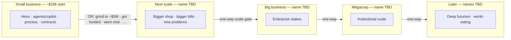

# P0.2 — Decision graph as curriculum map: Product plan

Date: 2026-08-11
Status: Direction settled; simplification next steps listed for issue cut
Milestone: [P0.2 — Decision graph as curriculum map](https://github.com/anne-markis/software-factory-the-game/milestone/2)
Extends: `docs/VISION.md` (updated same date), planning conversation 2026-08-11

This plan records the **settled product direction** for journeys / the
decision graph, and the **near-term simplification work** that should
become GitHub issues on P0.2 before we author longer eras. It is not yet
a full user-story / FR cut like P0.1; cut tickets from §4 when ready.

Existing honesty tickets (#39, #32, #47) remain in scope; they sit
alongside simplification rather than replacing it.

---

## 1. Settled direction (planning 2026-08-11)

### Long arc

- **One long game** with Paperclips cadence: long grinds between
  *scale* thresholds, then newly strange choices open. No win screen.
- **Eras = progression of scale (cost of play), not capability tracks.**
  Demarcate by what a factory can afford and what problems that scale
  invites — not by “pre-agent SDLC” vs “automation.” Starting from zero
  today, agents/coding assistants belong in the first era alongside
  hires, git, and (often later) CI/CD.
- **Tone:** early game is a credible **small business** software shop
  (starting ~$10k budget matches what you can buy). Weirdness, SV satire,
  and deep futurism intensify as scale eras advance — not as day-one
  flavor, and not gated behind “unlocking AI.”
- **False summits** still exist (e.g. “we made it / dark factory online”)
  but they sit on the **scale ladder**, not on a parallel automation
  track. Horizon keeps moving after each summit.
- **Whimsy** on scenarios and late choices; **systems honesty** stays in
  stocks, flows, delays, and governors.

### Eras vs old “tracks”

- **No first-class tracks or tags** as peer endgames (solo / startup /
  megacorp / darkfactory as mutually exclusive campaigns are retired).
- **Eras replace that vocabulary as a one-way progression ladder** —
  similar *names* may reappear (e.g. megacorp) but they mean **how big
  you are**, not which parallel fantasy you picked.
- **Within an era:** meander (hire-heavy, agent-heavy, process-heavy,
  viral/funding luck). **Between eras:** irreversible entry once scale
  criteria (or lucky breakthrough rolls) fire.
- Late / expensive world-eating content is gated by **being able to pay
  for it at that scale**. How you got the money is gameplay.

### Parked for a later pass

- Headcount (`human: true`) vs any leftover “human” labeling — revisit
  when touching hire/challenge content, not in the first simplification
  cut.
- Exact dollar thresholds past the first gate, breakthrough-roll design
  (“get funded”, “went viral”, …), and late era names — brainstorm in
  §5; ship after simplify + packaging.
- Full late-era sci-fi content authorship — after the graph is simpler
  and content-driven.

---

## 2. Architectural goals

1. **Journey graph lives in JSON.** Requires / unlocks / costs / effects /
   challenge gates / project gates / **era entry** should express
   progression. Prefer content fields + generic engine predicates over
   TypeScript that knows story beats or track names.
2. **Simplify before lengthening.** Remove first-class track/tag machinery
   and docs drift *before* splitting into multi-era content, so longer
   journeys do not grow on a dual human/tag/track vocabulary.
3. **Eras are first-class in content, not in story code.** Each era is its
   own JSON (bundle or folder — see §2.1). The engine may hold
   `state.eraId` (or equivalent) read from content and advance it when
   content-defined entry criteria fire. It must not hardcode era names,
   flavor, or per-era special cases in the tick.
4. **Era transitions are one-way.** Many steps may lead *into* an era;
   once entered, the player cannot return to a prior era’s shop/pool.
   Prior owned effects may still apply (or be retired by content rules) —
   the irreversible part is **which era’s decision/challenge graph is
   live**, not necessarily wiping history.
5. **Authoring visibility:** a light local graph viewer reads the same
   JSON and shows decisions → requires/criteria → era edges. Framework-
   only; stand up with `make graph` (or similar). Not part of the player
   game UI.
6. **Existing content is not sacred.** Cards, tags, and thin branches may
   be deleted or rewritten when they fight the spine.

### 2.1 ADR — Per-era JSON layout (proposed)

**Decision:** one content bundle per era; a small index lists order and
entry criteria.

Proposed shape (names flexible at implementation):

```text
content/
  start.json                 # global constants, seed stocks (era-agnostic)
  eras.json                  # ordered era ids + entry criteria (OR-able paths)
  eras/
    small-business/          # scale era 0 — ~$10k start fits the shop
      meta.json              # id, name, player-facing blurb (optional)
      decisions.json         # hires AND agents/copilot AND process, etc.
      challenges.json
      projects.json
    medium-business/         # name TBD — see §5
      ...
    big-business/
      ...
    megacorp/
      ...
```

**Do not** split eras by capability (e.g. “delivery” vs “automation”).
Agents belong in small-business content when costs fit that scale.

**Entry criteria** live in `eras.json` (or each era’s `meta.json`).
Prefer **OR of paths**, e.g. any of:

- slow grind: budget ≥ N (working example out of small-business: ~$5M)
  and/or reputation / contract tier floors;
- breakthrough rolls / challenges: “got funded”, “went viral”, etc.
  (exact events TBD — content, not engine special cases).

Crossing any listed path sets `eraId` forward only.

**Load merge rule (engine):** active content = `start` + **current era’s**
decisions/challenges/projects (plus any explicitly marked “carry”
globals if we need them). Prior-era decision *definitions* need not stay
in the shop; owned instances already on the save remain until removed by
normal rules unless content says otherwise.

**Rejected for now:** single monolithic `decisions.json` with an `era`
field on every card (harder to visualize/author per act); TypeScript
era enums; player-facing “pick your era” modes.

### 2.2 ADR — Graph viewer (proposed)

**Decision:** separate tiny static tool under something like
`tools/content-graph/`, not wired into the game shell.

- Reads era JSON via the same Zod parse path (or a thin shared loader).
- Renders nodes (decisions) and edges (`requires`, synergy `ifOwned`,
  era-entry edges).
- Shows criteria text on nodes/edges (cost, requires, era entry).
- Local only: `make graph` → serve on a localhost port (Vite or
  static). No deploy requirement for v1.
- Framework-light: plain HTML/CSS/JS or minimal Vite page; graph layout
  can start as layered DAG (era columns × require tiers), not a heavy
  editor.

Candidate issue **V-1** below.

---

## 3. Milestone intent (P0.2)

Make the **decision graph honest and content-owned**, strip track/tag
first-class concepts, and leave a clean surface for later era content —
without yet shipping the full sci-fi ladder.

**In one sentence:** by the end of P0.2, progression is “what you bought
and can afford *at this scale*,” expressed in JSON eras — with no track
taxonomy — and the graph does not lie about synergies, gambles, or the
release unlock path.

---

## 4. Next steps → candidate P0.2 issues

Cut these as GitHub issues when ready (titles are suggestions). Order is
**simplify first**, then honesty polish already filed, then light prep
for eras (docs/content shape only — not full sci-fi content).

### Must — simplify the journey surface

| ID | Candidate issue | Why |
| --- | --- | --- |
| **S-1** | Remove decision `tags` and challenge `hasTag` as first-class curriculum/track API | Settled: no tags/tracks. Today only `darkfactory` / `human` gates use `hasTag`; replace those gates with content predicates that do not invent a track layer (e.g. `requiresAnyDecision`, `minOwnedMatching`, or explicit decision-id / category gates — pick the smallest generic JSON shape). |
| **S-2** | Retire track vocabulary from docs and authoring guide | VISION updated; still need `CONTENT-AUTHORING.md`, design doc § tracks, triage prompt P1.1 mapping, and any “solo/startup/megacorp” authoring language aligned or marked historical. |
| **S-3** | Audit engine/UI for track/tag leakage and delete dead path | Orphan tag readers, UI “You are a solo dev” if it implies a track, tests that pin `hasTag: "darkfactory"` as a track concept, unused `process`/`solo` tag data once S-1 lands. Goal: smaller surface, journey edges only in content. |
| **S-4** | Replace darkfactory/human challenge gates with JSON-owned predicates | Companion to S-1: ship equivalent (or intentionally simpler) challenge eligibility without tags so automation-heavy and hire-heavy pools still differ because of **owned decisions / headcount / stocks**, not track labels. |

### Should — graph honesty (already filed)

| Issue | Role under new direction |
| --- | --- |
| **#39** | Unlock telegraph: Done bottleneck → test-suite / CI/CD path. Curriculum signpost without tracks. |
| **#32** | Agent harness synergy honesty. Trust on the automation ladder. |
| **#47** | Hire gamble downside telegraph. Early shop stays “boring but honest.” |

### Could — era packaging + authoring tools (after simplify)

| ID | Candidate issue | Why |
| --- | --- | --- |
| **E-1** | Split content into per-era JSON + `eras.json` with one-way **scale** entry criteria | Implements §2.1. First cut: put *all current* cards in `small-business`; stub next era + entry (budget floor and/or breakthrough placeholder) so loader/viewer are real before late-scale content exists. **Not** a delivery/automation split. |
| **E-2** | Inventory which current decisions fit small-business costs vs belong at later scale | Retune or move cards whose prices break the ~$10k-era fantasy; agents/copilot stay eligible early if costs fit. |
| **V-1** | Local content-graph viewer (`make graph`) | Implements §2.2. Reads era JSON; shows requires / costs / era-entry edges (including OR entry paths). Authoring aid only. |

### Explicitly out of scope for P0.2 issue cut

- Full late-scale / sci-fi decision/challenge wave
- Final names and $ thresholds for eras after the first gate (brainstorm OK)
- Player-optional / “factory without you” structure changes (long-term)
- Headcount flag redesign (parked)
- Reopening P0.1 cockpit work
- Shipping the graph viewer inside the player-facing game UI
- Capability-based era splits (delivery vs automation) — rejected

---

## 5. Eras brainstorm (scale ladder)

**Principle:** eras mark **how big the business is** (cost of decisions,
stakes of challenges, size of contracts). They do **not** mark “you
unlocked AI.” Capability mix (humans, agents, process) meanders *inside*
each era. Old “tracks” tried to be parallel plays; eras are the same
family of *identity words* used as **progression levels** instead.

**Within** an era: many purchases and lucky events. **Between** eras:
gated, irreversible entry.



| Era (working name) | Scale feel | What’s in the JSON shop | How you enter the *next* era |
| --- | --- | --- | --- |
| **Small business** | Starting $10k makes sense; local clients; payroll hurts | Current-ish loop: hires **and** early agents/copilot, test/CI/CD, debt work, small contracts. Order is meander (assistant-before-CI is fine). | **OR paths:** slow traditional (larger projects/reputation → e.g. **~$5M** banked); breakthrough rolls (“got funded”, “went viral”, … TBD). |
| **Medium business?** | Grown-up burn; serious vendors; still founder-visible | Higher-cost decisions; scarier incidents; mid-tier contracts. Agents scale up *because money allows*, not because a new track opened. | Budget / reputation / event OR — thresholds TBD. |
| **Big business?** | Org chart gravity; compliance-shaped pain | Expensive process, platform, headcount/compute at real scale. | TBD |
| **Megacorp?** | Institutional; you are a system inside a system | Political/process governors; huge contracts; satire seeds OK. | TBD |
| **Later…** | False summit then alien / world-eating | Sci-fi and Paperclips-energy mystery; dark-factory *consequences* at planetary cost. | Long grind; choices feel newly strange. |

### Naming notes (open)

“Medium / big business” is plain but clear. Alternatives to brainstorm:

- **Scale language:** Studio → Firm → Enterprise → Megacorp → …
- **Money language:** Bootstrap → Funded → Scale-up → Public / Megacorp → …
- **Factory language:** Garage factory → Floor → Campus → Conglomerate → …

Prefer names that read as **size**, not as a chosen fantasy. “Startup”
as an *era name* is awkward if funding is an *entry roll* into the next
era — better as an event (“got funded”) than as a rung label.

### Breakthrough entries (open, content later)

Lucky / high-variance OR paths out of small business (and maybe later):

- Got funded (term sheet / round)
- Went viral (reputation + inbound cash)
- Acqui-hire / acqui-exit partial (maybe too early)
- Whale contract signed

Exact design deferred; schema should allow **multiple OR entry
predicates** per era so grind and luck both work without engine forks.

---

## 6. Working definition of done (draft)

P0.2 is **done enough to close** when:

1. **No first-class tags/tracks** in schema, runtime challenge gating, or
   player-facing copy that teaches “you are on track X.”
2. **Challenge pools** that used `hasTag` still make sense via JSON-owned
   predicates (or are intentionally simplified with a milestone comment).
3. **Docs/authoring** no longer instruct authors to use track tags as the
   curriculum map (VISION + this plan + authoring guide agree).
4. **Honesty tickets** #39, #32, #47 closed or explicitly deferred with
   reason on the milestone.
5. **Era packaging path is clear:** either E-1 landed (per-era JSON +
   one-way entry stub) or explicitly deferred with the ADR accepted and
   a follow-up milestone noted — but authors must know the target layout.
6. **Graph viewer:** V-1 landed or deferred with `make graph` stub noted;
   preferred inside P0.2 so era splits are reviewable.
7. Tests + `npm run build` green; engine/UI boundary intact.

Full sci-fi ladder and funding-stopover content are **successors**, not
blockers for closing P0.2.

---

## 7. Relationship to other docs

| Doc | Role |
| --- | --- |
| `docs/VISION.md` | Living direction; medium-term attractor language updated to match this plan |
| `docs/superpowers/specs/2026-08-07-p01-cockpit-watchability-plan.md` | P0.1; Done cue without CI/CD name — #39 is the P0.2 handoff |
| `docs/CONTENT-AUTHORING.md` | Must be updated when S-1/S-2 land |
| `docs/OPEN-DECISIONS.md` | Unrelated open tactics; do not stuff journey eras here |
| `scripts/issue-triage-prompt.md` | Update P0.2 / P1.1 mapping when track vocabulary is retired |

When implementation specs conflict with this plan, update one deliberately
before coding.
