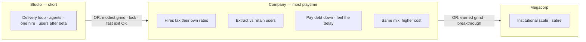
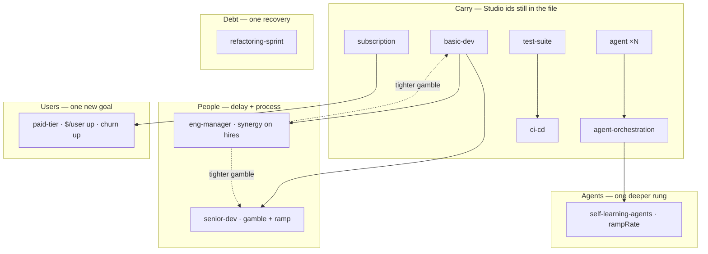

# Company era — brainstorm

Date: 2026-08-14 (revised same day: lesson-and-fun filter)
Status: Brainstorm (not a ticket cut, not an implementation spec)
Extends: `docs/VISION.md`, `docs/superpowers/specs/2026-08-11-p02-decision-graph-plan.md` §5
Stance: Fill the P0.2 plan’s “Company — light sketch, fill later” hole now that Studio is a playable spine

This document holds direction for the **Studio → Company** step. It does
not author cards, retune balance, or wire era advancement. Implementation
specs and content waves come after the forks in §13 are settled enough to
cut tickets.

**North star (non-negotiable, same as `docs/VISION.md`):** optimize fun
while teaching systems thinking, using the SDLC as the playground. The
delivery loop stays the home base. Company is a new *cost of play* on
that loop, not a simulation of a real firm. If a card’s best defense is
“companies actually do this,” it does not ship.

---

## 1. Why this doc, why now

Studio is a real era: lean shop, users-after-beta, stock-linked
monetization, empty later-era shells, tick that **does not** leave
Studio. Company is still `[]`. The vision already says Company is where
**most playtime lives**. The next useful work is not “dump the old
catalog into `content/eras/company/`” — it is deciding what *scale*
feels like once the tutorial is over, and what the engine must do
before any of those cards can stay honest.

The P0.2 plan parked exact entry numbers, breakthrough events, and the
Company graph. This pass fills that sketch the way §5.2–5.4 filled
Studio: first principles, systems hooks, settled leans, open forks.

---

## 2. Grounding (what is actually shipped)

### Studio spine (playable)

| Surface | Shipped |
| --- | --- |
| **Start** | $10k, $20/day burn, Launch beta 300 pts, $800 + 1 rep + 30 users on complete |
| **Users** | 0 until beta; then organic `1.5 + 0.1×reputation` / day, 1% churn; support drag above 25 users |
| **Shop (9)** | better-tooling · agent ×N · agent-harness · agent-orchestration · basic-dev (gamble, no `requires`) · test-suite → ci-cd · subscription · one-time-product |
| **Challenges (3)** | scope-creep (after 1 completion) · model-deprecation · runaway-agent-loop |
| **Studio projects.json** | small-crm / mobile-app / big-migration / enterprise-replatform — **the old contract ladder**, not the planned tiny gigs / v1–v5 |

Plan-settled Studio pieces that **did not ship**: went-viral, prod-incident,
angry-users, laptop-dies, the product version ladder, tiny client gigs.
Those are Studio follow-ups, not Company content — but they change how
fast a player can trip Company entry (see §5).

### Engine facts that bind Company

- **Active content = `start` + one era bundle.** Shop, challenges, and
  projects swap when `eraId` changes. Owned *instances* stay on the save.
- **`requires` / `requiresCounts` / `requiresAnyDecision` / `lacksDecision`
  are within the active era’s `decisions.json`.** A Company card cannot
  `requires: ["test-suite"]` unless `test-suite` is also listed in
  Company.
- **Defs are looked up live from the active catalog.** Upkeep, income,
  `human`, `continuousDeploy`, `stockFlowMods`, and challenge headcount
  all do `content.decisions.find(id)`. If Company omits `subscription`
  / `agent` / `ci-cd`, those owned Studio cards **stop billing and stop
  paying** while their already-applied modifiers linger. That is a silent
  exploit, not a flavor beat.
- **Tick does not evaluate `entryAnyOf`.** Crossing into Company is a
  later milestone (engine + UI), not a JSON-only change.
- **Available and unused in Studio:** `stockFlowMods`, `rampRate`,
  synergies, `incomePerDay`, `sickness`, `removeHuman`, the
  `prevent-trouble` shop section.
- **Not available:** morale / compute / valuation stocks; a way for a
  decision to raise the users support-drag free band; cross-era
  `requires`; a “carry this def after the shop swaps” flag.

### Already-settled product direction (do not re-litigate)

From VISION + P0.2 plan:

1. Eras mark **how big the factory is**, not which fantasy you picked.
2. Capability mix (hire-heavy, agent-heavy, process-heavy) **meanders
   inside** Company.
3. **`users` carries.** No soft reset, no second population.
4. Company is the **long session**. Studio stays short / exitable.
5. Depth and consequence before catalog width. **Lesson and fun before
   realism.** A wider shop that buries the loop is a failed era.
6. Governors on every reinforcing loop. Delays should start to be *felt*.
7. No first-class tracks. No hire-drama challenges as “fun realism”
   (Studio cut sickness / poach; do not sneak them back without a new
   reason).
8. Engine stays story-dumb. Era names do not belong in the tick.

---

## 3. What Company is for

**Studio** teaches the delivery loop, one AI seat type, one hire gamble,
and “users exist after you launch.” It should be leaveable before the
player has a real org.

**Company** is the same loop at a cost of play Studio could not show
without becoming a second tutorial: headcount that taxes itself,
reputation that finally gates work, debt you can *pay down* (and feel
the delay), users you can extract from. It is not “year one of a real
company.” Org-chart completeness is how this era fails.

The player should be able to say, in their own words:

- “I hired past the point where more people helped.”
- “I extracted more from users and they left.”
- “The refactor hurt for two weeks and then the incidents stopped.”
- “I still don’t have CI/CD and Done is a warehouse.”

That is Limits to Growth, Success to the Successful, and delay — lived,
not lectured. If a proposed card does not help the player say one of
those things (or a new sentence as sharp as those), it is catalog.

### 3.1 Lesson-and-fun filter (every new card)

Ask all three. “No” on any of them is a cut, including when the fiction
is accurate.

1. **Which loop does the player watch change?** Backlog / Done / debt /
   users / reputation / rates on the cockpit — not a side meter we
   invent so the card has somewhere to land.
2. **What systems idea is distinct from a card we already have?** If it
   is “hire, but contractor” or “incident, but DDoS,” it is the
   copilot-vs-agent trap again.
3. **Is it fun to watch?** Bottleneck moves, recovery is possible but
   not free, the shop does not bury the diagram. Unfun honesty gets
   redesigned; it does not get a realism exception, and it does not get
   replaced by a lecture.

Complexity is a privilege the loop and the player must be ready for.
Company is long so the *same* loops can deepen — not so we can finally
fit the industry.



---

## 4. Felt difference (systems curriculum)

Studio already exhibits bottleneck-moves, debt regen, context-switch
tax, and a users reinforcing loop with support drag. Company should
**re-interpret those stocks at a new cost of play**, and add only the
patterns the current grammar can honestly show.

| Pattern | How Company shows it (one lever) | Avoid |
| --- | --- | --- |
| **Limits to Growth** | Meeting-creep taxes the same rates the hires just boosted | Morale stock; three flavors of “org pain” |
| **Delay** | Senior ramps (`rampRate`); refactor slows before it helps | Instant senior = 3× basic-dev |
| **Success to the Successful** | Reputation gates real contracts; a Company-sized incident can re-lock them | A second “breach” fiction of the same hit |
| **Shifting the Burden** | Another agent vs a refactor | A track label that says which is “correct” |
| **Wrong goal (light)** | Paid tier raises `$/user` and churn | Marketing + CS + ads as a growth department |

Fun governor: if a card’s only job is to name a pattern, cut it. The
simulation has to produce the feeling first. Drift / burnout / policy
resistance wait until the sim already produces them — they are not a
reason to author three calendar events.

---

## 5. Crossing Studio → Company

### 5.1 Entry paths (numbers are working guesses)

Authored today in `content/eras.json` (viewer-only):

```text
minBudget 25000  OR  minReputation 40  OR  minCompletedProjects 4
```

Those numbers fight the “Studio is a short tutorial” rule.

| Path | Today | Lean | Why |
| --- | --- | --- | --- |
| **Grind cash** | $25k | **Keep ~$20–25k** | From $10k + sub on a small user base this is a short stay, not a second game |
| **Reputation** | 40 | **Drop to ~5–8** | 40 is past “Industry leader” (35). Trusted vendor (5) is the first time bigger work is even *about* you |
| **Completions** | 4 | **Drop to 2, or cut** | 4 only makes sense if Studio keeps the old CRM ladder. If Studio is beta + optional gigs, 4 is a long tutorial |
| **Users** | *(none)* | **Add ~80–100** | Lets a shipped *went-viral* (or organic growth) trip the gate without inventing a “viral era” flag |
| **Breakthrough events** | *(none)* | **Events grant stocks that trip the floors** | “Got funded” is +$ that hits `minBudget`. Do not add `hasSeenChallenge` to the engine for v0 |

Schema stays an OR of AND-floors (`minBudget` / `minReputation` /
`minCompletedProjects` / `minUsers`). Breakthroughs are content that
write those stocks, not new predicate types.

**Studio must remain exitable without CI/CD, without a hire, and
without finishing enterprise-shaped work.** Company re-teaches whatever
they skipped (see §6.1).

### 5.2 The orphan-def problem (must solve before any Company shop)

When `eraId` flips, `content.decisions` becomes the Company file only.
Every tick path that needs a def **skips** unknown ids (`if (!def)
continue` in `chargeUpkeep` / stock flows). Owned Studio agents would
keep their finish modifiers and **stop paying $4/day**. Owned
subscription would **stop paying `$/user`**. `ci-cd` would stop
qualifying as `continuousDeploy` because activation reads the live def.

P0.2’s “defs need not stay in the shop; instances remain” assumed
defs were still resolvable. They are not.

**Lean (content-first, no new engine flag):** Company `decisions.json`
**re-lists every Studio id** at the same id (so owned instances keep
working). Unique owned cards hide from the shop as they do today.
Stackables (`agent`, `basic-dev`) stay buyable — meander continues.
Players who rushed out of Studio still see test-suite / ci-cd /
monetization and can learn them at Company scale.

Rejected for v0:

- Snapshotting defs onto instances (save-shape change, larger than the
  era).
- A `carry: true` field (extra schema for the same catalog).
- Relisting at *new* prices under the same id (owned instances would
  silently change upkeep).
- Dropping Studio ids and hoping modifiers are enough (the exploit
  above).

If the Company shop feels too wide, that is a **visibility** problem
(owned uniques already vanish), not a reason to orphan defs.

### 5.3 What the player sees on the day they cross

One-way. No “pick Company.” The shop, challenge pool, and project list
swap. Stocks, owned instances, in-flight projects, and modifiers stay.
In-flight Studio contracts (if any still exist) complete under the
rules they started with; new offers are Company offers.

UI copy can name the era once (“You are running a company now”) the
same way milestones already banner. The tick still does not know the
word Company.

---

## 6. Decision graph (Company)

### 6.1 Carry (Studio ids, still listed)

These are not “new content.” They are the spine the player may already
own, and the safety net if they don’t.

| id | Company role |
| --- | --- |
| better-tooling · test-suite · ci-cd | Structural teach still available if skipped |
| agent · agent-harness · agent-orchestration | Fleet continues; orchestration is the Studio ceiling, not the Company ceiling |
| basic-dev | Still the hire; manager/senior hang off it |
| subscription · one-time-product | Monetization keeps reading `users` |

### 6.2 New Company plays (draft — not cards yet)

First-principles prompt: *What can the player see on the loop at this
scale that Studio could not show without stopping being a tutorial?*
Not: *what does a real company buy in year one?*

Pass the §3.1 filter. The table’s “why” column is the systems reason;
realism is not a reason.

**People / org — two cards, two lessons**

| Play | Distinct lesson | Systems hook | Lean |
| --- | --- | --- | --- |
| Senior hire | Delay: capacity arrives late, and you already paid | `human`, gamble, **`rampRate` onboarding** | **In** |
| Eng manager | Process changes *variance*, not rate (structure, not more tickets) | Unique; **synergy tightens hire gambles**; little or no direct rate | **In** — cut if the synergy is too quiet to watch |
| Contractor | “Hire, but not on the org chart” | Deterministic rate, debt, not `human` | **Out** — copilot-vs-agent trap |
| Standup-as-$/day | — | — | **Out** |
| Standup / cadence shield | Second calendar card | `lacksDecision` vs meeting-creep | **Out** — meeting-creep *is* the lesson |

**Debt you can finally pay — one recovery button**

| Play | Distinct lesson | Systems hook | Lean |
| --- | --- | --- | --- |
| Refactoring sprint | Hurt before help; debt is payable | Repeatable; temporary slowdown + techDebt down | **In** |
| Redesign / rebuild | Same lesson, bigger | Long slowdown | **Out of v0** — false-summit later, not a second refactor |

**Users — one new goal, not a growth department**

Organic acquire + support drag already run. Do not add a marketing
team so the era “has growth.”

| Play | Distinct lesson | Systems hook | Lean |
| --- | --- | --- | --- |
| Paid tier | Seeking the wrong goal: `$/user` up, churn up | `incomeFromStock` + `stockFlowMods` +churn | **In** — the one new users card |
| Marketing / launch push | Buy more of the acquire flow that already exists | `stockFlowMods` +acquire | **Out of v0** — same loop, extra knob |
| Customer success / docs | Buy less of the churn that already exists | `stockFlowMods` −churn | **Out of v0** — paid tier already makes churn the governor |
| Support capacity | Relief valve on drag | needs `stockDragMods` | **Out of v0** — do not add engine for a growth buy we just cut |

**Agents — one deeper rung**

| Play | Distinct lesson | Systems hook | Lean |
| --- | --- | --- | --- |
| Self-learning agents | Compounding delay on the agent loop; false summit | `rampRate` on finish; requires orchestration | **In** |
| GPU / compute stock | New meter | — | **Out** |

**Hardening — none in v0**

DDoS protection + DDoS, security program + breach, are “public
companies get attacked.” Prod-incident already hits the live-product
loop. A buy-out card for a new event is catalog. `prevent-trouble` can
wait until a challenge exists that is not just another incident.



**Target width:** carry (hidden once owned) + **five new uniques**
(senior, manager, refactor, paid-tier, self-learning). If a sixth card
cannot name a *new* loop sentence, it does not get in. This is not the
place to restore every Release 8 shop item.

### 6.3 Explicitly not Company-default

- Contractor, standup, marketing, CS, support-hire, DDoS pair, security
  program — realism / second knobs on loops we already teach.
- Morale / compute / valuation as stocks (VISION long-term; not earned
  yet).
- Hire-drama as a challenge genre (poach / flu).
- World-eating / self-learning-that-hires-itself — Megacorp and later.
- A second AI seat type that is mechanically “agent but cheaper.”

---

## 7. Projects

### 7.1 Move the old ladder out of Studio

`content/eras/studio/projects.json` currently holds Company-shaped
work. That makes Studio long and makes `minCompletedProjects: 4` look
affordable for the wrong reason. **Lean:** move the ladder out of
Studio; Company v0 keeps **two** client rungs. Studio projects become
whatever the Studio follow-up actually ships (tiny gigs / v1–v5) or
stay empty aside from `start.json`’s Launch beta.

| id | Size | Role in Company |
| --- | --- | --- |
| **small-crm** | 5k / $2k up | Early client; cash + rep. The first time reputation *means* work |
| **big-migration** | 20k / $5k | Serious delivery; debt and concurrency will show |
| **mobile-app** | 9k / $3k | Same lesson as CRM at a different size — **out of v0** |
| **enterprise-replatform** | 50k / $12k | **Megacorp-adjacent** — do not require it to enter or leave Company |

Two client rungs are enough for Success to the Successful to be
visible. Reputation gates (5 / 15) finally mean something: they are
Company landmarks, not Studio exits. `start.json` milestones
(“Trusted vendor”, “Established shop”) already speak this fiction.

### 7.2 Own-product work at Company scale

Users already exist. At most **one** own-product project in v0, and
only if it moves the users loop in a way the paid-tier *decision*
cannot. A growth-launch / paid-tier-ship / marketplace trio is a
product org, not a lesson.

| Working project | Role | Lean |
| --- | --- | --- |
| Paid-tier launch | Completing it makes the paid-tier decision *matter* (users or $ grant) | **Maybe** — skip if the decision alone is watchable |
| Growth / onboarding push | Extra acquire burst | **Out of v0** — organic flow already acquires |
| Marketplace / platform listing | Another income fiction | **Out of v0** |

Two families still hold: **own-product** (touches users) vs **client
contracts** (cash + rep, no direct users). Concurrency tax is the
teach: CRM *and* a product launch is how Company players stall
themselves — if we even ship the second family in v0.

### 7.3 Studio project follow-up (out of this era, but blocking honesty)

If Studio never gets tiny gigs / versions, players will keep using CRM
as “the next thing after beta” until someone moves the file. Company
entry numbers and Company project gates should be authored **as if**
that move already happened.

---

## 8. Challenges

Studio’s pool is small on purpose. Company may fire *harder*, not
*wider*. Three org slaps and three incident fictions are the same
lesson in different hats. Gates use stocks, headcount, and live
ownership — not tracks.

### 8.1 The v0 pool (five)

| Working id | Gate | Loop it hits | Lean |
| --- | --- | --- | --- |
| **scope-creep** | Any in-flight project | Backlog / WIP | **In — all eras** (bigger +N is enough scale) |
| **prod-incident** | `users > 0`; debt scales | Live product: $, **rep**, users, short slowdown | **In** — the one Company-sized teeth; Studio-settled and still unshipped |
| **meeting-creep** | `minHumanDevs ≥ 2` | Hire loop taxes its own rates | **In** — the one org card |
| **model-deprecation** | ≥1 agent | Agent loop; choice teach | **In** if agents are carried |
| **runaway-agent-loop** | ≥1 agent | Agent $ governor | **In** |

### 8.2 Cut — second knobs and realism slaps

| id | Why it fails the filter |
| --- | --- |
| **api-price-hike** | Third agent slap; “vendors raise prices” |
| **team-conflict** / **burnout** | Same Limits-to-Growth sentence as meeting-creep |
| **ddos** + protection card | New incident fiction; prod-incident already hits live product |
| **security-breach** | Second reputation nuke; make prod-incident fat enough |
| **angry-users** / review bomb | Churn already on prod-incident (and paid-tier) |
| **competitor launch** / **refund-wave** | Market realism |
| sickness / key-dev-poached | Stay cut |

Lucky +$ challenges stay scarce. A **term-sheet** with a quota is a
new loop (and a new way to lie about the goal). **Out of v0.** Megacorp
entry stays grind floors (`minBudget` / `minUsers`) until a
breakthrough can be one event that writes those stocks, not a mini-game.

### 8.3 Quiet period

Company does not need Studio’s “let them finish beta” quiet. It *does*
need spacing so the first week after the era swap is not a pile-on.
`challengeSpacingDays` is already global (35). **Lean:** keep that; do
not add `eraEnteredDay` so we can author a second quiet. Write
probabilities as if Company is the rest of the game.

---

## 9. Stocks and engine — what Company actually needs

**Do not invent a stock to make the era feel grown-up.** Users,
reputation, debt, and budget already scale. Prefer content that reads
them harder.

| Need | Already exists? | Lean |
| --- | --- | --- |
| Paid-tier churn | `stockFlowMods` | **Use it** on that one card — first shipped consumer |
| Onboarding delay | `rampRate` | **Use it** on senior |
| Hire-quality process | synergies | **Use it** on eng-manager → basic/senior gambles |
| Support-drag relief | **No** `stockDragMods` | **Out of v0.** Organic growth + existing drag is already the users governor. Do not add engine for a marketing buy we cut |
| Era advancement | `entryAnyOf` authored, not evaluated | **Required to play Company** — generic predicate eval + one-way `eraId` + reload active bundle. No era-name branches in tick |
| `eraEnteredDay` | No | **Out of v0** — global spacing is enough |
| Morale / compute / valuation | No | **Not Company v0** |
| Cross-era `requires` | No | **Not needed** if Company relists Studio ids |

`start.json` is era-agnostic. Organic user flow and support drag
**keep running** in Company — that is the carry. Do not special-case
“Studio-only drag” in the tick.

---

## 10. Governors (every growth loop)

| Reinforcing loop | Company governor |
| --- | --- |
| Ship → $ → more capacity | Payroll + base burn; insolvency still deletes `perDay` instances |
| Users → $ → more build | Support drag (already on); paid-tier churn; prod-incident |
| Agents → finish → more agents | Debt, model-deprecation, runaway loop |
| Hires → rate → more hires | Meeting-creep; onboarding delay; manager upkeep |
| Reputation → bigger contracts → more rep | Prod-incident rep hits re-lock tiers |

If a new card strengthens a loop and we cannot name its governor, it
does not ship.

---

## 11. Leaving Company (toward Megacorp)

Authored today: `minBudget 250000` OR `minUsers 10000`.

Company is the long era, so this gate should feel **earned**, not
skippable the way Studio’s should. Retune the floors in play. Do not
design Megacorp cards here, and do not invent a term-sheet mini-game
so the door has flavor.

False summit: self-learning agents plus a hard contract should feel
like “we made it.” Institutional weirdness is Megacorp’s job. Company
only has to make the door expensive.

---

## 12. What we are not doing in this pass

- Authoring the JSON or wiring `eraId` advancement (this doc only).
- Filling Megacorp.
- Restoring tracks, tags, or a “pick your identity” screen.
- New stocks, `stockDragMods`, or `eraEnteredDay` for v0.
- A realism catalog (contractor, DDoS, breach, marketing dept, burnout).
- A player-facing tech tree / graph (the local `make graph` viewer is
  enough to author).
- Reopening P0.1 cockpit work.
- Pretending Studio’s missing went-viral / version ladder is Company
  content.

---

## 13. Open forks (narrowed)

Settle these before cutting implementation tickets. Leans above are
starting positions, not locks.

1. **Carry catalog vs engine merge.** Relist Studio ids in Company
   (lean) vs load `start` + current era + defs for any owned unknown id
   (smaller shop file, extra loader rule). Relist is dumber and
   matches ADR 0001’s “put the card in the era folder.”
2. **Studio → Company floors.** Exact `$` / rep / completions / users.
   Lean: ~$20–25k, rep ~5–8, completions 2 or cut, add users ~80–100,
   breakthroughs write those stocks.
3. **Eng-manager stays** only if the hire-gamble synergy is watchable.
   If it reads as flavor, cut it and keep senior + meeting-creep as
   the people lesson.
4. **Paid-tier launch project** vs paid-tier *decision* alone.
5. **enterprise-replatform** waits for Megacorp (lean).
6. **Studio leftovers** (viral, prod-incident, gigs/versions) — Company
   ships prod-incident either way; the *projects* should not stay in
   Studio just because Company is empty.

Closed by the lesson-and-fun filter (not open): contractor, standup,
marketing/CS/support-hire, DDoS pair, breach, api-price-hike,
team-conflict, burnout, term-sheet quota, `stockDragMods`,
`eraEnteredDay`.

---

## 14. Suggested sequencing (not tickets)

When this brainstorm is settled enough:

1. **Engine: evaluate `entryAnyOf`, one-way `eraId`, reload the active
   bundle.** Without this, Company JSON is a viewer-only museum.
2. **Carry rule** (fork 1) so owned Studio cards keep paying and
   billing.
3. **Move the contract ladder** out of `studio/projects.json`; keep
   CRM + migration in Company, park enterprise.
4. **Author the thin Company v0:** five new uniques (senior, manager,
   refactor, paid-tier, self-learning) and five challenges
   (scope-creep, prod-incident, meeting-creep, model-deprecation,
   runaway-agent-loop). Probe solvency on a hire-heavy and an
   agent-heavy meander; no “buy everything” win.
5. **Retune entry floors** against a real Studio exit, not against the
   CRM ladder living in the wrong folder.

---

## Relationship to other docs

| Doc | Role |
| --- | --- |
| `docs/VISION.md` | Company = most playtime; eras not tracks |
| `docs/superpowers/specs/2026-08-11-p02-decision-graph-plan.md` | Studio zoom; this doc fills §5.3’s Company hole |
| `docs/CONTEXT.md` | Glossary; Company is no longer “empty shell, ignore” |
| `docs/CONTENT-AUTHORING.md` | How to write the cards once forks settle |
| `docs/adr/0001` | Per-era layout; advancement still future |
| `docs/OPEN-DECISIONS.md` | Unrelated tactics — do not stuff era design there |
