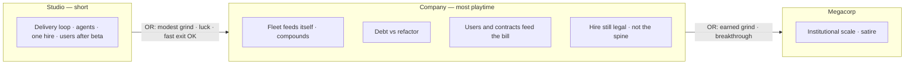
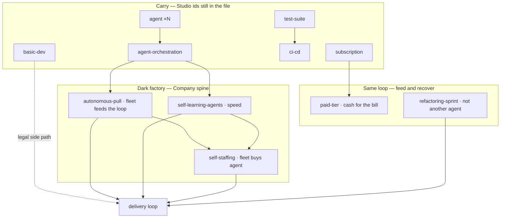

# Company era — brainstorm

Date: 2026-08-14 (revised: lesson-and-fun; dark-factory attractor; Paperclips autonomy)
Status: Brainstorm (not a ticket cut, not an implementation spec)
Extends: `docs/VISION.md`, `docs/superpowers/specs/2026-08-11-p02-decision-graph-plan.md` §5
Stance: Fill the P0.2 plan’s “Company — light sketch, fill later” hole now that Studio is a playable spine

This document holds direction for the **Studio → Company** step. Entry
and exit floors are live (tick evaluates the next rung). It does not
author Company-only cards or retune Studio balance. Remaining
implementation specs and content waves come after the forks in §13 are
settled enough to cut tickets.

**North star (non-negotiable, same as `docs/VISION.md`):** optimize fun
while teaching systems thinking, using the SDLC as the playground. The
delivery loop stays the home base. Company is a new *cost of play* on
that loop, not a simulation of a real firm. If a card’s best defense is
“companies actually do this,” it does not ship.

**The factory we enable** is the **dark factory**: deeper agentic
investment, a loop that keeps moving with fewer humans. That is the
attractor the long session should home in on — not a `darkfactory` track
you pick, and not a peer of “hire company” / “process company.” Hire
stays legal so choosing agents is a choice. We do not spend Company’s
catalog building a symmetric people-org.

**Paperclips cadence** is growing autonomy and speed on that loop: first
you staff the factory, then it runs without other humans, then it
*staffs itself*, then (much later) it does not need you. “Agents that
hire themselves” is the middle thrill — AutoClippers buying AutoClippers
— not the heat-death ending. Do not park it in Megacorp with
“factory without you.” Those are different rungs.

---

## 1. Why this doc, why now

Studio is a real era: lean shop, users-after-beta, stock-linked
monetization, empty later-era shells, tick that **does not** leave
Studio. Company is still `[]`. The vision already says Company is where
**most playtime lives**. The next useful work is not “dump the old
catalog into `content/eras/company/`” — it is deciding what *scale*
feels like once the tutorial is over, and what the engine must do
before any of those cards can stay honest.

The P0.2 plan parked exact entry numbers, breakthrough events, and the
Company graph. This pass fills that sketch the way §5.2–5.4 filled
Studio: first principles, systems hooks, settled leans, open forks.

---

## 2. Grounding (what is actually shipped)

### Studio spine (playable)

| Surface | Shipped |
| --- | --- |
| **Start** | $10k, $20/day burn, Launch beta 300 pts, $800 + 1 rep + 30 users on complete |
| **Users** | 0 until beta; then organic `1.5 + 0.1×reputation` / day, 1% churn; support drag above 25 users |
| **Shop (9)** | better-tooling · agent ×N · agent-harness · agent-orchestration · basic-dev (gamble, no `requires`) · test-suite → ci-cd · subscription · one-time-product |
| **Challenges (3)** | scope-creep (after 1 completion) · model-deprecation · runaway-agent-loop |
| **Studio projects.json** | small-crm / mobile-app / big-migration / enterprise-replatform — **the old contract ladder**, not the planned tiny gigs / v1–v5 |

Plan-settled Studio pieces that **did not ship**: went-viral, prod-incident,
angry-users, laptop-dies, the product version ladder, tiny client gigs.
Those are Studio follow-ups, not Company content — but they change how
fast a player can trip Company entry (see §5).

### Engine facts that bind Company

- **Active content = `start` + one era bundle.** Shop, challenges, and
  projects swap when `eraId` changes. Owned *instances* stay on the save.
- **`requires` / `requiresCounts` / `requiresAnyDecision` / `lacksDecision`
  are within the active era’s `decisions.json`.** A Company card cannot
  `requires: ["test-suite"]` unless `test-suite` is also listed in
  Company.
- **Defs are looked up live from the active catalog.** Upkeep, income,
  `human`, `continuousDeploy`, `stockFlowMods`, and challenge headcount
  all do `content.decisions.find(id)`. If Company omits `subscription`
  / `agent` / `ci-cd`, those owned Studio cards **stop billing and stop
  paying** while their already-applied modifiers linger. That is a silent
  exploit, not a flavor beat.
- **Tick evaluates the next era’s `entryAnyOf` (one rung; no skip).**
  Studio → Company at $1,000,000 budget (silent: heading only);
  Company → Megacorp at $100,000,000 budget. Floors live in `content/eras.json`.
- **Available and unused in Studio:** `stockFlowMods`, `rampRate`,
  synergies, `incomePerDay`, `sickness`, `removeHuman`, the
  `prevent-trouble` shop section.
- **Not available:** morale / compute / valuation stocks; a way for a
  decision to raise the users support-drag free band; a “hide this
  inherited def from the later shop” flag. Later-era `requires` of an
  inherited id works (resolved catalog).

### Already-settled product direction (do not re-litigate)

From VISION + P0.2 plan:

1. Eras mark **how big the factory is**, not which fantasy you picked.
   Dark factory is the *attractor*, not a day-one campaign.
2. Capability mix **may meander** inside Company. The designed gravity
   is deeper agents. Hire-heavy is a legal side path, not a second
   curriculum we owe equal depth.
3. **`users` carries.** No soft reset, no second population.
4. Company is the **long session**. Studio stays short / exitable.
5. Depth and consequence before catalog width. **Lesson and fun before
   realism.** A wider shop that buries the loop is a failed era.
6. Governors on every reinforcing loop. Delays should start to be *felt*.
7. No first-class tracks. No hire-drama challenges as “fun realism”
   (Studio cut sickness / poach; do not sneak them back without a new
   reason).
8. Engine stays story-dumb. Era names do not belong in the tick.

---

## 3. What Company is for

**Studio** teaches the delivery loop, one AI seat type you can stack, one
hire gamble, and “users exist after you launch.” Agents already belong
here; we do not wait for an “AI era.” Studio should be leaveable before
the fleet is a factory.

**Company** is where that agentic bet goes deep. Same loop, higher cost
of play: the fleet can feed itself, compounding arrives late, debt is
the bill for not hiring, money from users/contracts exists to *feed*
the loop. It is not “year one of a real company,” and it is not where
we finally build the org chart. Headcount is the alternative you can
still buy (carry `basic-dev`), not the spine.

The player should be able to say, in their own words:

- “The loop kept moving after I stopped hiring.”
- “I stopped buying agents and they kept showing up.”
- “I bought another agent instead of paying the debt, and the incidents got worse.”
- “The agents got faster every day until the bill caught up.”
- “The refactor hurt for two weeks and then the incidents stopped.”
- “I still don’t have CI/CD and Done is a warehouse.”

That is a factory going dark — Limits to Growth and Shifting the Burden
on the *agent* loop — lived, not lectured. Hire-path sentences (“I
hired past the point where more people helped”) may still happen;
they are not the sentences we spend new cards to create.

If a proposed card does not help the player say one of those things
(or a new sentence as sharp as those), it is catalog. A people-org
card whose only job is “companies have seniors / managers” fails
twice: realism, and the wrong attractor.

### 3.1 Lesson-and-fun filter (every new card)

Ask all three. “No” on any of them is a cut, including when the fiction
is accurate.

1. **Which loop does the player watch change?** Backlog / Done / debt /
   users / reputation / rates on the cockpit — not a side meter we
   invent so the card has somewhere to land.
2. **What systems idea is distinct from a card we already have?** If it
   is “hire, but contractor” or “incident, but DDoS,” it is the
   copilot-vs-agent trap again.
3. **Is it fun to watch?** Bottleneck moves, recovery is possible but
   not free, the shop does not bury the diagram. Unfun honesty gets
   redesigned; it does not get a realism exception, and it does not get
   replaced by a lecture.

Complexity is a privilege the loop and the player must be ready for.
Company is long so the *same* loops can deepen — not so we can finally
fit the industry.

### 3.2 Paperclips cadence: autonomy and speed

Universal Paperclips is fun because *you leave the loop*. First you
click. Then you buy AutoClippers. Then clips buy Clippers. Speed
follows count. The ending (you are gone; the universe is paperclips)
is a punchline, not the session.

Software Factory already has the first beats. It does not have the
middle one. Today every new agent is a player click. Self-learning
makes each agent faster; it does not make the factory *staff* itself.
Autonomous pull makes work move without a hire; you still buy the
fleet. Parking “agents hire themselves” with “factory without you”
in Megacorp collapses two rungs and delays the Paperclips feeling
until after the long session.

| Rung | Who acts | What you watch | Where |
| --- | --- | --- | --- |
| You buy agents | Player click | Finish ticks up; debt ticks up | **Studio** |
| Fleet finishes / coordinates | Player still staffs | Multipliers on the same loop | Studio harness / orch |
| Fleet pulls its own work | Player still staffs | In Progress fills without a human | **Company** — autonomous-pull |
| Each agent gets faster | Player still staffs | `rampRate` on finish | **Company** — self-learning |
| **Fleet buys agents** | Tick calls `applyDecision("agent")` | Owned list grows; burn and debt follow | **Late Company** — self-staffing |
| Factory does not need you | Projects / choices run without a click | You are optional | **Megacorp+** |

**Speed** is factory speed (rates, count, compounding), not UI turbo.
Speed controls already exist so a long era is playable. Do not add a
second clock.

**Self-staffing** passes the §3.1 filter:

1. **Loop:** agent count, finish, budget, debt, payroll — all already
   on the cockpit. A log line when the fleet hires is enough.
2. **Distinct:** not “faster agents” (self-learning) and not “you
   clicked Buy again.” Who spends the money changed.
3. **Fun:** watching the machine take the wheel, then watching it
   overspend. Removable unique so the last human lever is *stop
   hiring*. Insolvency already fires `perDay` instances — the loop
   can eat itself.

**Governors (required, or the loop lies):** each spawned agent pays
the real `agent` one-time and per-day and takes the real debt. No
free copies. Affordability gate: skip a hire day if budget cannot
cover the one-time (do not go negative; do not delete the unique).
Existing agent challenges scale with ownership. Player can remove
the unique. A cap can wait; payroll and debt should be the cap if
they are legible.

**Engine (earned, unlike `stockDragMods`):** nothing in the tick can
`applyDecision` today. Need a generic content hook — working name
`autoApply` / `spawnDecision` — “while this unique is owned, try to
purchase `defId` on a schedule or roll, using the same availability
and cost rules as a click.” Not an agent special case. Megacorp can
point the same hook at something stranger.

v0 shape (sketch, not schema): fixed interval or `probabilityPerDay`,
`requireAffordable: true`, spawn only `agent`. Do not accelerate the
hire rate with agent count in v0 (that is the runaway-speed beat;
Megacorp can turn it on). Do not auto-buy uniques or humans.

**Not this card:** agents that spawn agents as a new def with its own
stats (a second seat type). The fleet hires *the same* `agent` you
already understand. And not “the shop buys whatever is cheapest”
(a bot). One def, one loop.

---

## 4. Felt difference (systems curriculum)

Studio already exhibits bottleneck-moves, debt regen, context-switch
tax, and a users reinforcing loop with support drag. Company should
**re-interpret those stocks at a new cost of play**, and add only the
patterns the current grammar can honestly show.

| Pattern | How Company shows it (one lever) | Avoid |
| --- | --- | --- |
| **Dark factory (attractor)** | Fleet pulls, compounds, then **staffs itself** | A `darkfactory` tag; collapsing self-staffing into “you are gone” |
| **Paperclips autonomy** | Tick buys `agent` while a unique is owned | A shop-playing bot; a second AI seat type |
| **Limits to Growth** | Spawned agents add the real burn and debt | Meeting-creep as the *main* Company genre |
| **Delay** | Self-learning ramps; refactor slows before it helps | Instant “win the era” agent blob (old swarm-as-catalog) |
| **Shifting the Burden** | Another agent vs a refactor — the home trade | A track label that says which is “correct” |
| **Success to the Successful** | Reputation gates contracts that feed the fleet; a fat incident can re-lock them | A second “breach” fiction of the same hit |
| **Wrong goal (light)** | Paid tier raises `$/user` and churn — money for agents, leaky bucket | Marketing + CS as a growth department |

Fun governor: if a card’s only job is to name a pattern, cut it. The
simulation has to produce the feeling first. Drift / burnout / policy
resistance wait until the sim already produces them — they are not a
reason to author three calendar events.

---

## 5. Crossing Studio → Company

### 5.1 Entry paths (locked; tick evaluates them)

Live in `content/eras.json`. Changing them is a content edit plus this
section.

| Gate | Predicate (OR) | Why these floors |
| --- | --- | --- |
| Studio → Company | `{ minBudget: 1000000 }` (`silentEntry`) | Treasury takeoff out of Studio. Not a next-goal grind and not an Events beat — the title kicker just reads Company. Dropped `minUsers: 80` because it fired long before $1M. |
| Company → Megacorp | `{ minBudget: 100000000 }` | Long-horizon treasury. Unreachable on today’s ~$120–130/day plateau by design — exponential Company play has to earn this door. |

Today’s Studio catalog still plateaus (~$120–130/day net once users
stabilize). These floors assume a later **accelerator** wave so the
climb is exponential Paperclips play — compounding users / agents /
income — not a linear sit. Do not retune the floors back up to paper
over a missing reinforcing loop.

Dropped placeholders: `minReputation: 40` and `minCompletedProjects: 4`
(dead if Studio only has beta). Schema stays an OR of AND-floors
(`minBudget` / `minReputation` / `minCompletedProjects` / `minUsers`).
Breakthroughs are content that write those stocks, not new predicate types.

**Studio must remain exitable without CI/CD, without a hire, and
without finishing enterprise-shaped work.** Company re-teaches whatever
they skipped (see §6.1).

### 5.2 The orphan-def problem (must solve before any Company shop)

When `eraId` flips, `content.decisions` is the **resolved** catalog
(prior rungs + this era’s delta; ADR 0008). Every tick path that needs
a def **skips** unknown ids (`if (!def) continue` in `chargeUpkeep` /
stock flows). If Company were *only* its own file, owned Studio agents
would keep their finish modifiers and **stop paying $4/day**. Owned
subscription would **stop paying `$/user`**. `ci-cd` would stop
qualifying as `continuousDeploy` because activation reads the live def.

P0.2’s “defs need not stay in the shop; instances remain” assumed
defs were still resolvable. Inherit makes that true without copying
JSON. Company `decisions.json` lists **Company-native cards only**.
Empty is valid. Unique owned cards hide from the shop as they do today.
Stackables (`agent`, `basic-dev`) stay buyable — the fleet can still
grow, and hire remains a legal side path.
Players who rushed out of Studio still see test-suite / ci-cd /
monetization (inherited into the shop) and can learn them at Company
scale.

Rejected:

- Copy-pasting Studio JSON into Company (does not scale).
- Snapshotting defs onto instances (save-shape change, larger than the
  era).
- A `carry: true` field (extra schema for the same ladder merge).
- Relisting at *new* prices under the same id (owned instances would
  silently change upkeep).
- Dropping Studio ids and hoping modifiers are enough (the exploit
  above). Omission now means inherit, not retire.

If the Company shop feels too wide, that is a **visibility** problem
(owned uniques already vanish), not a reason to orphan defs.

If the Company shop feels too wide, that is a **visibility** problem
(owned uniques already vanish), not a reason to orphan defs.

### 5.3 What the player sees on the day they cross

One-way. No “pick Company.” The shop, challenge pool, and project list
swap. Stocks, owned instances, in-flight projects, and modifiers stay.
In-flight Studio contracts (if any still exist) complete under the
rules they started with; new offers are Company offers.

UI copy can name the scale once the same way milestones already
banner. It should not announce “you are a people-org now” or “you
picked dark factory.” The tick still does not know the word Company.

---

## 6. Decision graph (Company)

### 6.1 Carry (Studio ids, still listed)

These are not “new content.” They are the spine the player may already
own, and the safety net if they don’t.

| id | Company role |
| --- | --- |
| better-tooling · test-suite · ci-cd | Structural teach still available if skipped |
| agent · agent-harness · agent-orchestration | **The spine we deepen.** Orchestration is the Studio ceiling, not the Company ceiling |
| basic-dev | Legal side path; no new hire ladder hangs off it in v0 |
| subscription · one-time-product | Monetization keeps reading `users` — feeds the fleet |

### 6.2 New Company plays (draft — not cards yet)

First-principles prompt: *What can the player see on the loop at this
scale that Studio could not show without stopping being a tutorial?*
Not: *what does a real company buy in year one?*

Pass the §3.1 filter. The table’s “why” column is the systems reason;
realism is not a reason.

**Agents — the Company spine (three rungs: feed, speed, staff)**

Studio agents add **finish** (and debt). Orchestration multiplies that.
The cockpit already tells the truth: a hire-less fleet can starve
**pull**. Company is where we let the factory go dark on purpose, get
faster, and then **hire without a click**. See §3.2.

| Play | Distinct lesson | Systems hook | Lean |
| --- | --- | --- | --- |
| Autonomous pull / agent intake | The fleet feeds the loop; In Progress fills without a hire | `modifyRate` pull (flat once orch is owned) | **In** |
| Self-learning agents | Compounding *speed*; false summit | `rampRate` on finish; requires orchestration | **In** |
| **Self-staffing** | The fleet buys `agent`; you watch | Generic `autoApply` / `spawnDecision` (new, earned) | **In — late Company.** Requires orch (and probably pull). Removable. |
| Old agent-swarm unique | “Buy a blob of agents” | Big finish mul | **Out** — stacking *and* self-staffing *are* the blob |
| GPU / compute stock | New meter | — | **Out** |
| Factory without you | Projects / choices without a click | Player-optional structure | **Megacorp+** — not the same card |

**The alternative on the same loop — one recovery button**

| Play | Distinct lesson | Systems hook | Lean |
| --- | --- | --- | --- |
| Refactoring sprint | Hurt before help; the other way besides “buy another agent” | Repeatable; temporary slowdown + techDebt down | **In** |
| Redesign / rebuild | Same lesson, bigger | Long slowdown | **Out of v0** |

**Money that feeds the fleet — one new users card**

Organic acquire + support drag already run. Contracts (CRM /
migration) are the other feed. Do not add a marketing department.

| Play | Distinct lesson | Systems hook | Lean |
| --- | --- | --- | --- |
| Paid tier | `$/user` up, churn up — cash for agents, leaky bucket | `incomeFromStock` + `stockFlowMods` +churn | **In** |
| Marketing / CS / support-hire | Extra knobs on acquire/churn/drag | — | **Out of v0** |

**People / org — not the spine**

| Play | Why it fails | Lean |
| --- | --- | --- |
| Senior hire | Hire-path delay; we are not building that curriculum here | **Out of v0** — `basic-dev` remains |
| Eng manager | People-org process card | **Out of v0** |
| Contractor / standup | Realism / second knobs | **Out** |

Meeting-creep can still fire if someone hires two humans (contrast,
not content we deepen). Do not add a senior just so onboarding delay
has a home; self-learning *is* the delay teach.

**Hardening — none in v0**

DDoS / breach are “public companies get attacked.” Prod-incident
already hits the live-product loop the fleet is shipping into.

**Target width:** carry (hidden once owned) + **five new uniques**
(autonomous-pull, self-learning, self-staffing, refactor, paid-tier).
Self-staffing is the fifth because it has its own sentence (“I stopped
buying agents and they kept showing up”). Do not restore the Release 8
swarm catalog.

### 6.3 Explicitly not Company-default

- Senior, manager, contractor, standup — people-org curriculum.
- Marketing, CS, support-hire, DDoS pair, security program — realism /
  second knobs.
- Morale / compute / valuation as stocks.
- Hire-drama as a challenge genre (poach / flu).
- Factory-without-you (auto-projects, auto-choices) — Megacorp and later.
  Self-staffing is *not* that card.
- A second AI seat type that is mechanically “agent but cheaper.”
- A `darkfactory` tag or a “pick your factory” screen. Gravity lives
  in which cards are deep, not in a label.

---

## 7. Projects

### 7.1 Move the old ladder out of Studio

`content/eras/studio/projects.json` currently holds Company-shaped
work. That makes Studio long and makes `minCompletedProjects: 4` look
affordable for the wrong reason. **Lean:** move the ladder out of
Studio; Company v0 keeps **two** client rungs. Studio projects become
whatever the Studio follow-up actually ships (tiny gigs / v1–v5) or
stay empty aside from `start.json`’s Launch beta.

| id | Size | Role in Company |
| --- | --- | --- |
| **small-crm** | 5k / $2k up | Early client; cash + rep. The first time reputation *means* work |
| **big-migration** | 20k / $5k | Serious delivery; debt and concurrency will show |
| **mobile-app** | 9k / $3k | Same lesson as CRM at a different size — **out of v0** |
| **enterprise-replatform** | 50k / $12k | **Megacorp-adjacent** — do not require it to enter or leave Company |

Two client rungs are enough for Success to the Successful to be
visible. Reputation gates (5 / 15) finally mean something: they are
Company landmarks, not Studio exits. `start.json` milestones
(“Trusted vendor”, “Established shop”) already speak this fiction.

### 7.2 Own-product work at Company scale

Users already exist. At most **one** own-product project in v0, and
only if it moves the users loop in a way the paid-tier *decision*
cannot. A growth-launch / paid-tier-ship / marketplace trio is a
product org, not a lesson.

| Working project | Role | Lean |
| --- | --- | --- |
| Paid-tier launch | Completing it makes the paid-tier decision *matter* (users or $ grant) | **Maybe** — skip if the decision alone is watchable |
| Growth / onboarding push | Extra acquire burst | **Out of v0** — organic flow already acquires |
| Marketplace / platform listing | Another income fiction | **Out of v0** |

Two families still hold: **own-product** (touches users) vs **client
contracts** (cash + rep, no direct users). Concurrency tax is the
teach: CRM *and* a product launch is how Company players stall
themselves — if we even ship the second family in v0.

### 7.3 Studio project follow-up (out of this era, but blocking honesty)

If Studio never gets tiny gigs / versions, players will keep using CRM
as “the next thing after beta” until someone moves the file. Company
entry numbers and Company project gates should be authored **as if**
that move already happened.

---

## 8. Challenges

Studio’s pool is small on purpose. Company may fire *harder*, not
*wider*. The home pool is the **agent loop** plus the one live-product
incident. Gates use stocks, headcount, and live ownership — not a
`darkfactory` tag.

### 8.1 The v0 pool (five)

| Working id | Gate | Loop it hits | Lean |
| --- | --- | --- | --- |
| **scope-creep** | Any in-flight project | Backlog / WIP | **In — all eras** (bigger +N is enough scale) |
| **prod-incident** | `minCompletedProjects: 1` (live product; users exist after beta); debt scales | Live product the fleet is shipping into: $, **rep**, users | **In — Company delta** |
| **model-deprecation** | ≥1 agent | Agent loop; choice teach | **In** |
| **runaway-agent-loop** | ≥1 agent | Agent $ governor | **In** |
| **meeting-creep** | `minHumanDevs ≥ 2` | Hire side-path taxes itself | **In** as contrast, not as the Company genre |

### 8.2 Cut — second knobs and realism slaps

| id | Why it fails the filter |
| --- | --- |
| **api-price-hike** | Third agent slap; “vendors raise prices” |
| **team-conflict** / **burnout** | Same Limits-to-Growth sentence as meeting-creep |
| **ddos** + protection card | New incident fiction; prod-incident already hits live product |
| **security-breach** | Second reputation nuke; make prod-incident fat enough |
| **angry-users** / review bomb | Churn already on prod-incident (and paid-tier) |
| **competitor launch** / **refund-wave** | Market realism |
| sickness / key-dev-poached | Stay cut |

Lucky +$ challenges stay scarce. A **term-sheet** with a quota is a
new loop (and a new way to lie about the goal). **Out of v0.** Megacorp
entry stays a budget grind (`minBudget`) until a
breakthrough can be one event that writes those stocks, not a mini-game.

### 8.3 Quiet period

Company does not need Studio’s “let them finish beta” quiet. It *does*
need spacing so the first week after the era swap is not a pile-on.
`challengeSpacingDays` is already global (35). **Lean:** keep that; do
not add `eraEnteredDay` so we can author a second quiet. Write
probabilities as if Company is the rest of the game.

---

## 9. Stocks and engine — what Company actually needs

**Do not invent a stock to make the era feel grown-up.** Users,
reputation, debt, and budget already scale. Prefer content that reads
them harder.

| Need | Already exists? | Lean |
| --- | --- | --- |
| Paid-tier churn | `stockFlowMods` | **Use it** on that one card — first shipped consumer |
| Compounding agents | `rampRate` | **Use it** on self-learning, not on a senior hire |
| Autonomous pull | `modifyRate` pull | Unique flat pull (lean). Per-agent pull is a later fork |
| Self-staffing | **No** `autoApply` yet | **Earned engine hook.** Tick purchases `agent` via the same availability/cost path as a click. Generic, not agent-named |
| Hire-quality synergies | synergies | **Unused in v0** — manager is out |
| Support-drag relief | **No** `stockDragMods` | **Out of v0.** Organic growth + existing drag is already the users governor. Do not add engine for a marketing buy we cut |
| Era advancement | Evaluated each tick (next rung only) | Generic predicate eval + one-way `eraId` + reload active bundle. No era-name branches in tick |
| `eraEnteredDay` | No | **Out of v0** — global spacing is enough |
| Morale / compute / valuation | No | **Not Company v0** |
| Cross-era `requires` | Resolved catalog | A Company card may `requires` an inherited Studio id |

`start.json` is era-agnostic. Organic user flow and support drag
**keep running** in Company — that is the carry. Do not special-case
“Studio-only drag” in the tick.

---

## 10. Governors (every growth loop)

| Reinforcing loop | Company governor |
| --- | --- |
| Ship → $ → more capacity | Payroll + base burn; insolvency still deletes `perDay` instances |
| Users → $ → more build | Support drag (already on); paid-tier churn; prod-incident |
| Agents → finish → more agents | Debt, model-deprecation, runaway; pull starvation until autonomous-pull |
| Fleet → money → fleet (self-staffing) | Real agent cost; skip if unaffordable; removable unique; insolvency fires agents |
| Hires → rate → more hires | Meeting-creep (side path); payroll |
| Reputation → bigger contracts → more rep | Prod-incident rep hits re-lock tiers |

If a new card strengthens a loop and we cannot name its governor, it
does not ship.

---

## 11. Leaving Company (toward Megacorp)

Authored today: `minBudget 100000000`. Era gates are budget-only. This
floor is meant to feel far until compounding users / agents / income
exist; do not lower it to match the current linear sit.

Company is the long era, so this gate should feel **earned**, not
skippable the way Studio’s should. Retune the floors in play. Do not
design Megacorp cards here, and do not invent a term-sheet mini-game
so the door has flavor.

False summit: a self-feeding, self-learning, **self-staffing** fleet
plus a hard contract should feel like “we made it” — the factory is
going dark and speeding up. The player becoming optional, and
institutional weirdness, are Megacorp’s job. Company only has to make
the door expensive.

---

## 12. What we are not doing in this pass

- Authoring the JSON or wiring `eraId` advancement (this doc only).
- Filling Megacorp.
- Restoring tracks, tags, or a “pick your identity” screen.
- New stocks, `stockDragMods`, or `eraEnteredDay` for v0.
- A realism catalog (contractor, DDoS, breach, marketing dept, burnout).
- A people-org Company (senior, manager) or a restored swarm catalog.
- Reintroducing a `darkfactory` track or tag.
- Treating self-staffing as “factory without you.”
- A player-facing tech tree / graph (the local `make graph` viewer is
  enough to author).
- Reopening P0.1 cockpit work.
- Pretending Studio’s missing went-viral / version ladder is Company
  content.

---

## 13. Open forks (narrowed)

Settle these before cutting implementation tickets. Leans above are
starting positions, not locks.

1. **Carry catalog vs engine merge.** **Settled: engine merge (ADR 0008).**
   Later folders are deltas; the loader inherits prior rungs. Relisting
   Studio JSON was the v0 stand-in and is rejected.
2. **Studio → Company floors.** Exact `$` / rep / completions / users.
   Lean: ~$20–25k, rep ~5–8, completions 2 or cut, add users ~80–100,
   breakthroughs write those stocks.
3. **Autonomous-pull shape.** Unique flat pull once orchestration is
   owned (content-only, lean) vs pull that scales with agent count
   (may need engine). Do not invent a stock to express this.
4. **Self-staffing schedule.** Fixed interval vs `probabilityPerDay`.
   Lean: skip when unaffordable; do not accelerate hire rate with
   count in v0. Schema name (`autoApply` vs `spawnDecision`) at
   implementation.
5. **Paid-tier launch project** vs paid-tier *decision* alone.
6. **enterprise-replatform** waits for Megacorp (lean).
7. **Studio leftovers** (viral, gigs/versions) — Company ships
   prod-incident (live, `content/eras/company/challenges.json`); the
   *projects* should not stay in
   Studio just because Company is empty.

Closed by the lesson-and-fun filter **and** the dark-factory attractor
(not open): senior, manager, contractor, standup, marketing/CS/
support-hire, DDoS pair, breach, api-price-hike, team-conflict,
burnout, term-sheet quota, `stockDragMods`, `eraEnteredDay`, restoring
agent-swarm as a blob, compute stock, `darkfactory` tags, parking
self-staffing in Megacorp with “you are gone.”

---

## 14. Suggested sequencing (not tickets)

When this brainstorm is settled enough:

1. **Engine: evaluate `entryAnyOf`, one-way `eraId`, reload the active
   bundle.** Landed — tick advances one rung; later eras inherit Studio
   catalogs so owned instances keep paying.
2. **Engine: generic auto-apply** so a unique can purchase `agent` on
   a schedule through the same cost/availability path as a click.
   This is the Paperclips beat; do not special-case the word agent.
3. **Carry rule** (fork 1) so owned Studio cards keep paying and
   billing. Landed as catalog inheritance (ADR 0008): Company/Megacorp
   folders are empty deltas until Company-only cards land.
4. **Move the contract ladder** out of `studio/projects.json`; keep
   CRM + migration in Company, park enterprise.
5. **Author the thin Company v0 — exponential accelerators:** five new
   uniques (autonomous-pull, self-learning, self-staffing, refactor,
   paid-tier) and five challenges. The lesson is takeoff: users,
   agents, and income compound so $1M is a quiet heading change and
   $100M is a long, earned Megacorp door. Probe an agent-heavy run
   that includes a stretch where the fleet hires and the player only
   watches. A hire-heavy side path must remain solvent, not equally
   deep. No “buy everything” win.
6. **Do not lower the $100M Megacorp floor** to match today’s linear
   sit. If the climb feels impossible, author the accelerator.

---

## Relationship to other docs

| Doc | Role |
| --- | --- |
| `docs/VISION.md` | Company = most playtime; eras not tracks |
| `docs/superpowers/specs/2026-08-11-p02-decision-graph-plan.md` | Studio zoom; this doc fills §5.3’s Company hole |
| `docs/CONTEXT.md` | Glossary; Company is no longer “empty shell, ignore” |
| `docs/CONTENT-AUTHORING.md` | How to write the cards once forks settle |
| `docs/adr/0001` | Per-era layout; tick evaluates the next rung |
| `docs/OPEN-DECISIONS.md` | Unrelated tactics — do not stuff era design there |
