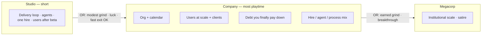
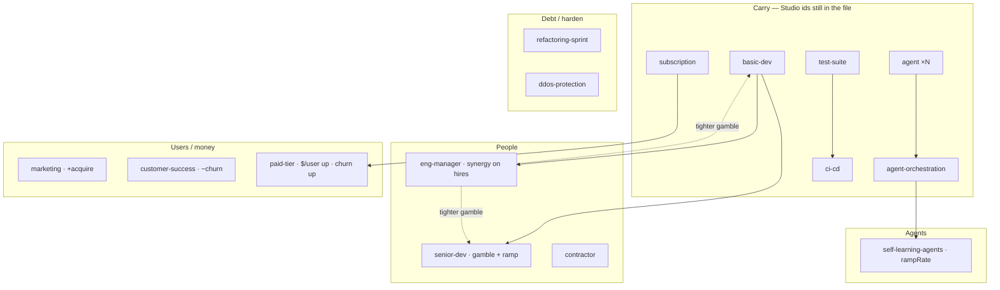

# Company era — brainstorm

Date: 2026-08-14
Status: Brainstorm (not a ticket cut, not an implementation spec)
Extends: `docs/VISION.md`, `docs/superpowers/specs/2026-08-11-p02-decision-graph-plan.md` §5
Stance: Fill the P0.2 plan’s “Company — light sketch, fill later” hole now that Studio is a playable spine

This document holds direction for the **Studio → Company** step. It does
not author cards, retune balance, or wire era advancement. Implementation
specs and content waves come after the forks in §13 are settled enough to
cut tickets.

---

## 1. Why this doc, why now

Studio is a real era: lean shop, users-after-beta, stock-linked
monetization, empty later-era shells, tick that **does not** leave
Studio. Company is still `[]`. The vision already says Company is where
**most playtime lives**. The next useful work is not “dump the old
catalog into `content/eras/company/`” — it is deciding what *scale*
feels like once the tutorial is over, and what the engine must do
before any of those cards can stay honest.

The P0.2 plan parked exact entry numbers, breakthrough events, and the
Company graph. This pass fills that sketch the way §5.2–5.4 filled
Studio: first principles, systems hooks, settled leans, open forks.

---

## 2. Grounding (what is actually shipped)

### Studio spine (playable)

| Surface | Shipped |
| --- | --- |
| **Start** | $10k, $20/day burn, Launch beta 300 pts, $800 + 1 rep + 30 users on complete |
| **Users** | 0 until beta; then organic `1.5 + 0.1×reputation` / day, 1% churn; support drag above 25 users |
| **Shop (9)** | better-tooling · agent ×N · agent-harness · agent-orchestration · basic-dev (gamble, no `requires`) · test-suite → ci-cd · subscription · one-time-product |
| **Challenges (3)** | scope-creep (after 1 completion) · model-deprecation · runaway-agent-loop |
| **Studio projects.json** | small-crm / mobile-app / big-migration / enterprise-replatform — **the old contract ladder**, not the planned tiny gigs / v1–v5 |

Plan-settled Studio pieces that **did not ship**: went-viral, prod-incident,
angry-users, laptop-dies, the product version ladder, tiny client gigs.
Those are Studio follow-ups, not Company content — but they change how
fast a player can trip Company entry (see §5).

### Engine facts that bind Company

- **Active content = `start` + one era bundle.** Shop, challenges, and
  projects swap when `eraId` changes. Owned *instances* stay on the save.
- **`requires` / `requiresCounts` / `requiresAnyDecision` / `lacksDecision`
  are within the active era’s `decisions.json`.** A Company card cannot
  `requires: ["test-suite"]` unless `test-suite` is also listed in
  Company.
- **Defs are looked up live from the active catalog.** Upkeep, income,
  `human`, `continuousDeploy`, `stockFlowMods`, and challenge headcount
  all do `content.decisions.find(id)`. If Company omits `subscription`
  / `agent` / `ci-cd`, those owned Studio cards **stop billing and stop
  paying** while their already-applied modifiers linger. That is a silent
  exploit, not a flavor beat.
- **Tick does not evaluate `entryAnyOf`.** Crossing into Company is a
  later milestone (engine + UI), not a JSON-only change.
- **Available and unused in Studio:** `stockFlowMods`, `rampRate`,
  synergies, `incomePerDay`, `sickness`, `removeHuman`, the
  `prevent-trouble` shop section.
- **Not available:** morale / compute / valuation stocks; a way for a
  decision to raise the users support-drag free band; cross-era
  `requires`; a “carry this def after the shop swaps” flag.

### Already-settled product direction (do not re-litigate)

From VISION + P0.2 plan:

1. Eras mark **how big the factory is**, not which fantasy you picked.
2. Capability mix (hire-heavy, agent-heavy, process-heavy) **meanders
   inside** Company.
3. **`users` carries.** No soft reset, no second population.
4. Company is the **long session**. Studio stays short / exitable.
5. Depth and consequence before catalog width.
6. Governors on every reinforcing loop. Delays should start to be *felt*.
7. No first-class tracks. No hire-drama challenges as “fun realism”
   (Studio cut sickness / poach; do not sneak them back without a new
   reason).
8. Engine stays story-dumb. Era names do not belong in the tick.

---

## 3. What Company is for

**Studio** teaches the delivery loop, one AI seat type, one hire gamble,
and “users exist after you launch.” It should be leaveable before the
player has a real org.

**Company** is the first time the factory is a *firm*: payroll is a
structure, calendar is a tax, clients have names, the product has a
market, and last era’s clever trick becomes this era’s load.

The player should be able to say, in their own words:

- “I hired past the point where more people helped.”
- “I extracted more from users and they left.”
- “The refactor hurt for two weeks and then the incidents stopped.”
- “I still don’t have CI/CD and Done is a warehouse.”

That is Limits to Growth, Success to the Successful, and delay — lived,
not lectured.



---

## 4. Felt difference (systems curriculum)

Studio already exhibits bottleneck-moves, debt regen, context-switch
tax, and a users reinforcing loop with support drag. Company should
**re-interpret those stocks at a new cost of play**, and add only the
patterns the current grammar can honestly show.

| Pattern | How Company shows it | Avoid |
| --- | --- | --- |
| **Limits to Growth** | Headcount and meetings tax the same rates the hires just boosted | A morale stock on day one of the era |
| **Delay** | Onboarding ramps (`rampRate`); refactor slows before it helps | Instant senior = 3× basic-dev |
| **Success to the Successful** | Reputation finally gates real contracts; incidents can re-lock them | Milestones as victory |
| **Shifting the Burden** | Another agent vs a refactor; another hire vs a manager | A track label that says which is “correct” |
| **Drift** | Meeting-creep / burnout that accumulate if ignored | Permanent un-clearable rot |
| **Wrong goal (light)** | Paid tier raises `$/user` and churn | Full valuation / lifestyle mode (P2.2) |

Fun governor: if a card’s only job is to name a pattern, cut it. The
simulation has to produce the feeling first.

---

## 5. Crossing Studio → Company

### 5.1 Entry paths (numbers are working guesses)

Authored today in `content/eras.json` (viewer-only):

```text
minBudget 25000  OR  minReputation 40  OR  minCompletedProjects 4
```

Those numbers fight the “Studio is a short tutorial” rule.

| Path | Today | Lean | Why |
| --- | --- | --- | --- |
| **Grind cash** | $25k | **Keep ~$20–25k** | From $10k + sub on a small user base this is a short stay, not a second game |
| **Reputation** | 40 | **Drop to ~5–8** | 40 is past “Industry leader” (35). Trusted vendor (5) is the first time bigger work is even *about* you |
| **Completions** | 4 | **Drop to 2, or cut** | 4 only makes sense if Studio keeps the old CRM ladder. If Studio is beta + optional gigs, 4 is a long tutorial |
| **Users** | *(none)* | **Add ~80–100** | Lets a shipped *went-viral* (or organic growth) trip the gate without inventing a “viral era” flag |
| **Breakthrough events** | *(none)* | **Events grant stocks that trip the floors** | “Got funded” is +$ that hits `minBudget`. Do not add `hasSeenChallenge` to the engine for v0 |

Schema stays an OR of AND-floors (`minBudget` / `minReputation` /
`minCompletedProjects` / `minUsers`). Breakthroughs are content that
write those stocks, not new predicate types.

**Studio must remain exitable without CI/CD, without a hire, and
without finishing enterprise-shaped work.** Company re-teaches whatever
they skipped (see §6.1).

### 5.2 The orphan-def problem (must solve before any Company shop)

When `eraId` flips, `content.decisions` becomes the Company file only.
Every tick path that needs a def **skips** unknown ids (`if (!def)
continue` in `chargeUpkeep` / stock flows). Owned Studio agents would
keep their finish modifiers and **stop paying $4/day**. Owned
subscription would **stop paying `$/user`**. `ci-cd` would stop
qualifying as `continuousDeploy` because activation reads the live def.

P0.2’s “defs need not stay in the shop; instances remain” assumed
defs were still resolvable. They are not.

**Lean (content-first, no new engine flag):** Company `decisions.json`
**re-lists every Studio id** at the same id (so owned instances keep
working). Unique owned cards hide from the shop as they do today.
Stackables (`agent`, `basic-dev`) stay buyable — meander continues.
Players who rushed out of Studio still see test-suite / ci-cd /
monetization and can learn them at Company scale.

Rejected for v0:

- Snapshotting defs onto instances (save-shape change, larger than the
  era).
- A `carry: true` field (extra schema for the same catalog).
- Relisting at *new* prices under the same id (owned instances would
  silently change upkeep).
- Dropping Studio ids and hoping modifiers are enough (the exploit
  above).

If the Company shop feels too wide, that is a **visibility** problem
(owned uniques already vanish), not a reason to orphan defs.

### 5.3 What the player sees on the day they cross

One-way. No “pick Company.” The shop, challenge pool, and project list
swap. Stocks, owned instances, in-flight projects, and modifiers stay.
In-flight Studio contracts (if any still exist) complete under the
rules they started with; new offers are Company offers.

UI copy can name the era once (“You are running a company now”) the
same way milestones already banner. The tick still does not know the
word Company.

---

## 6. Decision graph (Company)

### 6.1 Carry (Studio ids, still listed)

These are not “new content.” They are the spine the player may already
own, and the safety net if they don’t.

| id | Company role |
| --- | --- |
| better-tooling · test-suite · ci-cd | Structural teach still available if skipped |
| agent · agent-harness · agent-orchestration | Fleet continues; orchestration is the Studio ceiling, not the Company ceiling |
| basic-dev | Still the hire; manager/senior hang off it |
| subscription · one-time-product | Monetization keeps reading `users` |

### 6.2 New Company plays (draft — not cards yet)

First-principles prompt: *I just left the studio. I have some users, a
loop I understand, and maybe a person or a few agents. What do I
actually do in the first year of a real company — and what breaks?*

**People / org**

| Play | Why it’s real | Systems hook | Lean |
| --- | --- | --- | --- |
| Senior hire | Expensive, variance, not day-one Studio | `human`, gamble, **`rampRate` onboarding** (delay) | **In** |
| Contractor | Fast capacity, messier, not on the org chart | Deterministic rate, debt add, **not** `human` | **In** |
| Eng manager | Coordination, better hiring, not more tickets | Unique; **synergy tightens hire gambles**; little or no direct rate | **In** |
| Standup-as-$/day | Ritual is time, not payroll | — | **Out** (same Studio critique) |
| Standup / cadence as process | Meetings that help *and* cost attention | Unique; small rate mul **or** `lacksDecision` shield vs meeting-creep | **Maybe** — only if meeting-creep ships |

**Debt you can finally pay**

| Play | Why it waited | Systems hook | Lean |
| --- | --- | --- | --- |
| Refactoring sprint | Studio had no recovery button | Repeatable; temporary slowdown + `addToStock` techDebt down | **In** — the delay teach |
| Redesign / rebuild | Bet-the-company rewrite | Long slowdown, bigger debt cut | **Push late Company / Megacorp** |

**Users at scale** (stock-linked; no new stock)

| Play | Why it’s real | Systems hook | Lean |
| --- | --- | --- | --- |
| Marketing / launch push | Growth is a buy, not a time-ramp | `stockFlowMods` +acquire (engine-ready, Studio unused) | **In** |
| Customer success / docs | Retention is a buy | `stockFlowMods` −churn | **In** |
| Paid tier / annual plan | Extract more per user | Higher `incomeFromStock` perUnit; **+churn** as governor | **In** |
| Support capacity | Drag free-band is 25 and already brutal at 80+ users | No `stockDragMods` today | **Open** — see §9. Do not fake it with a raw `modifyRate` unless we say so |

**Agents, one rung deeper**

| Play | Why it waited | Systems hook | Lean |
| --- | --- | --- | --- |
| Self-learning agents | Compounding, false summit | `rampRate` on finish; requires orchestration (now listable because carry) | **In** |
| GPU / compute stock | Real, but a new stock | — | **Out of Company v0** — keep agent pain in $ and debt |

**Hardening**

| Play | Why it waited | Systems hook | Lean |
| --- | --- | --- | --- |
| DDoS protection | Public product at company traffic | `prevent-trouble`; `lacksDecision` on a ddos challenge | **In** as a pair |
| Security program | Breach is a Company-scale nuke | Unique; reduces breach odds or severity via `lacksDecision` / debt | **Maybe** — only with security-breach |



**Target width:** carry (hidden once owned) + about **8–12 new uniques**
and the two stackables. If a card does not change a loop or a governor,
it does not get in. This is not the place to restore every Release 8
shop item.

### 6.3 Explicitly not Company-default

- Morale / compute / valuation as stocks (VISION long-term; not earned
  yet).
- Standup as daily cash burn.
- Hire-drama as a challenge genre (poach / flu) unless a later pass
  finds a *gameable* version.
- World-eating / self-learning-that-hires-itself / dark-factory endgame
  — that is Megacorp and later, at a cost you can only pay then.
- A second AI seat type that is mechanically “agent but cheaper.”

---

## 7. Projects

### 7.1 Move the old ladder out of Studio

`content/eras/studio/projects.json` currently holds Company-shaped
work. That makes Studio long and makes `minCompletedProjects: 4` look
affordable for the wrong reason. **Lean:** those four contracts are
Company (or Megacorp-adjacent) content. Studio projects become whatever
the Studio follow-up actually ships (tiny gigs / v1–v5) or stay empty
aside from `start.json`’s Launch beta.

| id | Size | Role in Company |
| --- | --- | --- |
| **small-crm** | 5k / $2k up | Early Company client; cash + rep |
| **mobile-app** | 9k / $3k | Mid client; Trusted-vendor-ish gate |
| **big-migration** | 20k / $5k | Serious delivery; debt will show |
| **enterprise-replatform** | 50k / $12k | **Late Company or Megacorp** — do not require it to *enter* Company, and think twice before requiring it to *leave* |

Reputation gates on these (5 / 15) finally mean something: they are
Company landmarks, not Studio exits. `start.json` milestones
(“Trusted vendor”, “Established shop”) already speak this fiction.

### 7.2 Own-product work at Company scale

Users already exist. Company product projects should **move the users
loop**, not invent customers.

| Working project | Role | Hook |
| --- | --- | --- |
| Growth / onboarding push | Own-product | `completionStockGrants` users and/or a one-shot acquire burst |
| Paid-tier launch | Own-product | Bonus users or $; pairs with the paid-tier *decision* (decision still separate, same as Studio sub) |
| Marketplace / platform listing | Own-product or hybrid | Users + burst income |

Keep the two families from the P0.2 plan: **own-product** (touches
users) vs **client contracts** (cash + rep, no direct users).
Concurrency tax is the teach: taking CRM *and* a growth launch is how
Company players stall themselves.

### 7.3 Studio project follow-up (out of this era, but blocking honesty)

If Studio never gets tiny gigs / versions, players will keep using CRM
as “the next thing after beta” until someone moves the file. Company
entry numbers and Company project gates should be authored **as if**
that move already happened.

---

## 8. Challenges

Studio’s pool is small on purpose. Company is allowed to be denser, but
every card still has to hit a loop we teach. Gates use stocks,
headcount, and live ownership — not tracks.

### 8.1 Carry-shaped (same loops, new scale)

| Working id | Gate | Effect sketch | Lean |
| --- | --- | --- | --- |
| **scope-creep** | Any in-flight project | Backlog +N (bigger than Studio’s +75) | **In — all eras** |
| **prod-incident** | `users > 0`; debt scales | $, rep, short slowdown, user hit (`scaleStock` / `addToStock`) | **In** (Studio-settled, unshipped — Company must have it even if Studio stays quiet) |
| **model-deprecation** | ≥1 agent | Pay vs degraded finish | **In** if agents are carried |
| **runaway-agent-loop** | ≥1 agent | −$ (can scale later) | **In** |
| **api-price-hike** | ≥1 agent | −$ or a long upkeep-shaped budget hit | **In** — Company agent governor |

### 8.2 Org / calendar (the Company genre)

| Working id | Gate | Effect sketch | Lean |
| --- | --- | --- | --- |
| **meeting-creep** | `minHumanDevs ≥ 2` (or ≥1 + manager) | All rates ×0.9 for a long window; cooldown | **In** |
| **team-conflict** | `minHumanDevs ≥ 2` | Choice: pay to mediate vs long rate hit | **In** |
| **burnout** | Headcount or a high-rate proxy | Choice: slow down vs later worse hit / debt | **In** — this is the standup/burnout deferral from Studio |
| sickness / key-dev-poached | — | — | **Stay cut** unless we find a version that is a decision, not a slap |

### 8.3 Market / hardening

| Working id | Gate | Effect sketch | Lean |
| --- | --- | --- | --- |
| **ddos** | users above a band; `lacksDecision: ddos-protection` | −$ | **In** as a pair with the card |
| **security-breach** | `minTechDebt` high | Fat $ and rep hit; can re-lock contracts | **In** — reputation downward spiral finally has a Company-sized teeth |
| **angry-users** / review bomb | users > 0 | Churn + light rep | **In** if Studio still hasn’t shipped it |
| **competitor launch** | users > 0 | Churn spike and/or acquire pause | **Maybe** — only if marketing exists so the player has a lever |
| **refund-wave** | one-time-product owned | −$ burst | **Maybe** |

Lucky +$ challenges stay scarce. Company is long; a drip of windfalls
teaches nothing. A single **term-sheet / got-funded** choice (large +$,
maybe a quiet quota later) is the breakthrough toward Megacorp, not a
weekly lottery.

### 8.4 Quiet period

Company does not need Studio’s “let them finish beta” quiet. It *does*
need spacing so the first week after the era swap is not a pile-on.
`challengeSpacingDays` is global in `start.json` (35 today) — era-specific
spacing is an engine fork, not a v0 requirement. Prefer per-challenge
`minDay` relative to… we do not have `eraEnteredDay` yet. **Open:**
either add that stamp when advancement lands, or keep global spacing
and write Company probabilities as if the era is the whole remaining
game.

---

## 9. Stocks and engine — what Company actually needs

**Do not invent a stock to make the era feel grown-up.** Users,
reputation, debt, and budget already scale. Prefer content that reads
them harder.

| Need | Already exists? | Lean |
| --- | --- | --- |
| Marketing / retention knobs | `stockFlowMods` | **Use it** — first shipped consumers |
| Onboarding delay | `rampRate` | **Use it** on senior (and maybe manager-era hires) |
| Hire-quality process | synergies | **Use it** on eng-manager → basic/senior gambles |
| Support-drag relief | **No** `stockDragMods` | **Open.** At 100 users the shipped drag is already ~0.30. Company without a support lever makes growth strictly punitive. Options: (a) small generic `stockDragMods` (freeBand / dragPerPoint deltas), (b) retune `start.json` free band now that Company is real, (c) a crude `modifyRate` “support hire” we admit is a fake. Prefer (a) if we touch the engine at all; (b) is a lie if Studio still uses the same start blob |
| Era advancement | `entryAnyOf` authored, not evaluated | **Required to play Company** — generic predicate eval + one-way `eraId` + reload active bundle. No era-name branches in tick |
| `eraEnteredDay` | No | Only if Company challenges need a post-entry quiet |
| Morale / compute / valuation | No | **Not Company v0** |
| Cross-era `requires` | No | **Not needed** if Company relists Studio ids |

`start.json` is era-agnostic. Organic user flow and support drag
**keep running** in Company — that is the carry. Do not special-case
“Studio-only drag” in the tick. If Company needs a different free
band, that is a content/engine hook (§13 fork 3), not an `if (eraId
=== "studio")`.

---

## 10. Governors (every growth loop)

| Reinforcing loop | Company governor |
| --- | --- |
| Ship → $ → more capacity | Payroll + base burn; insolvency still deletes `perDay` instances |
| Users → $ → more build | Support drag (already on); churn from incidents / paid tier / angry-users |
| Agents → finish → more agents | Debt, model-deprecation, api-price-hike, runaway loop |
| Hires → rate → more hires | Meeting-creep, burnout, manager upkeep, onboarding delay |
| Reputation → bigger contracts → more rep | Breach / incident rep hits re-lock tiers (already live) |
| Marketing → users | Drag + churn; marketing without CS is a leaky bucket |

If a new card strengthens a loop and we cannot name its governor, it
does not ship.

---

## 11. Leaving Company (toward Megacorp)

Authored today: `minBudget 250000` OR `minUsers 10000`.

Company is the long era, so this gate should feel **earned**, not
skippable the way Studio’s should. $250k is modest next to an older
~$5M sketch; 10k users is a real product. **Lean:** keep an OR of
serious grind and a serious breakthrough (term sheet / acquisition
attention / true viral scale), and retune the floors in play — not in
this brainstorm. Do not design Megacorp cards here.

False summit: self-learning agents + enterprise-replatform should feel
like “we made it” and then reveal institutional problems. That feeling
is Megacorp’s job. Company only has to make the door expensive.

---

## 12. What we are not doing in this pass

- Authoring the JSON or wiring `eraId` advancement (this doc only).
- Filling Megacorp.
- Restoring tracks, tags, or a “pick your identity” screen.
- New stocks for flavor.
- A player-facing tech tree / graph (the local `make graph` viewer is
  enough to author).
- Reopening P0.1 cockpit work.
- Pretending Studio’s missing went-viral / version ladder is Company
  content.

---

## 13. Open forks (narrowed)

Settle these before cutting implementation tickets. Leans above are
starting positions, not locks.

1. **Carry catalog vs engine merge.** Relist Studio ids in Company
   (lean) vs load `start` + current era + defs for any owned unknown id
   (smaller shop file, extra loader rule). Relist is dumber and
   matches ADR 0001’s “put the card in the era folder.”
2. **Studio → Company floors.** Exact `$` / rep / completions / users.
   Lean: ~$20–25k, rep ~5–8, completions 2 or cut, add users ~80–100,
   breakthroughs write those stocks.
3. **Support-drag relief.** `stockDragMods` vs retune global free band
   vs admit a fake rate card. This is the one engine addition that
   might be *earned* for Company.
4. **Standup / cadence card.** Ship only as a meeting-creep shield or
   skip and let meeting-creep be the whole calendar lesson.
5. **`eraEnteredDay` + post-entry quiet** vs global `challengeSpacingDays`
   only.
6. **enterprise-replatform** lives in late Company or waits for
   Megacorp.
7. **Term sheet** as Company→Megacorp breakthrough vs cash-only grind.
8. **Studio leftovers** (viral, prod-incident, gigs/versions) — Company
   can include the challenges either way; the *projects* should not
   stay in Studio just because Company is empty.

---

## 14. Suggested sequencing (not tickets)

When this brainstorm is settled enough:

1. **Engine: evaluate `entryAnyOf`, one-way `eraId`, reload the active
   bundle.** Without this, Company JSON is a viewer-only museum.
2. **Carry rule** (fork 1) so owned Studio cards keep paying and
   billing.
3. **Move the contract ladder** out of `studio/projects.json` into
   Company (and decide where enterprise sits).
4. **Author the thin Company v0:** people (senior, contractor, manager),
   refactor, marketing + CS + paid tier, ddos pair, self-learning,
   org/hardening challenges. Probe in simulation the way Studio was
   probed — solvency, at least one hire-heavy and one agent-heavy
   meander, no “buy everything” win.
5. **Retune entry floors** against a real Studio exit, not against the
   CRM ladder living in the wrong folder.
6. Only then: support-drag hook (if fork 3 demands it), term sheet,
   Megacorp sketch.

---

## Relationship to other docs

| Doc | Role |
| --- | --- |
| `docs/VISION.md` | Company = most playtime; eras not tracks |
| `docs/superpowers/specs/2026-08-11-p02-decision-graph-plan.md` | Studio zoom; this doc fills §5.3’s Company hole |
| `docs/CONTEXT.md` | Glossary; Company is no longer “empty shell, ignore” |
| `docs/CONTENT-AUTHORING.md` | How to write the cards once forks settle |
| `docs/adr/0001` | Per-era layout; advancement still future |
| `docs/OPEN-DECISIONS.md` | Unrelated tactics — do not stuff era design there |
